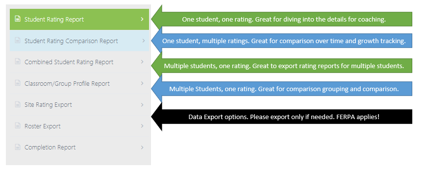

# Devereux Student Strengths Assessment

Last Update: 1/14/2021 @ 12:50pm

## What is DESSA?

The [DESSA](https://apertureed.com/research/about-the-dessa/) is a Socio-Emotional Learning assessment that allows educators to measure and take action on student social and emotional learning. The DESSA is based on [resiliance Theory](https://link.springer.com/chapter/10.1007/978-1-4614-3661-4_14) and uses the [CASEL Framework](https://casel.org/fundamentals-of-sel/what-is-the-casel-framework/) as the basis for the eight competencies observed under the assessment.

As noted by Aperture Education:

> "The DESSA is commonly used to inform the delivery of SEL at Tier 1 or Tier 2 as well as measuring the results of that delivery. The DESSA suite includes assessments and screeners that adapt to K-8 and 9-12 settings."

DESSA observations can be completed by an array of school based staff and is based on student strengths aka positive behaviors. Raters are asked to submit responses based on a five point scale on how often students engage in a specific behavior over the last four weeks.

[What is the DESSA?](https://selcompass.zendesk.com/hc/en-us/articles/360040521712-What-is-the-DESSA-and-what-does-it-measure-)

[What is a T-Score?](https://selcompass.zendesk.com/hc/en-us/articles/360041397051-What-are-the-three-score-ranges-and-how-do-I-interpret-scores-)

## City Year and DESSA

City Year uses the DESSA as both an observational note catcher and a resource for materials that help us differentiate student supports in specific competencies. DESSA helps us identify areas for studnet growth and provides us with some templates, resources and ideas to get started in working with students.

To see a list of questions on the DESSA see the document below.

```pdf
   files/Items_on_DESSA_40.pdf
```

For a full list of questions you will be asked when submitting a rating see the PDF below. Note that each questionare is 40 questions long.

```pdf
   files/DESSA_40_Printable.pdf
```
In FY23 Cit Year will be administering 3 DESSA ratings within the windows listed below. Schools have some flexiblity with these windows but should consult with their PD and Impact Analytics.

|                 Item                	|    Start   	|     End    	|       Who?     |
|:-----------------------------------:	|:----------:	|:----------:	|:--------------:|
|   DESSA Observation Round 1 Window  	| 10/03/2022 	| 11/04/2022 	| All Focus List |
| DESSA Administration Round 1 Window 	| 10/31/2022 	| 11/04/2022 	| All Focus List |
|   DESSA Observation Round 2 Window  	| 2/06/2023  	| 3/03/2023  	| SED Only       |
| DESSA Administration Round 2 Window 	| 3/06/2023  	| 3/17/2023   	| SED Only       |
|   DESSA Observation Round 3 Window  	| 4/24/2023  	| 5/19/2023  	| All Focus List |
| DESSA Administration Round 3 Window 	| 5/22/2023  	| 6/02/2023   	| All Focus List |

The first rating is a baseline for all focus list students (11 students) for all ACMs.

The second rating would be only for SED students meaning 5 out of 11 students for first and second years and no students for Team Leaders.

The third rating would again be for all students (11 students) for all ACMs.

## DESSA Ratings

See below for a quick walkthrough of how to submit a DESSA 40 rating. Note that before you can submit a rating you must have focus list students enrolled in CYSchoolhouse. Confirm with your PM if these tasks have been completed prior to submitting a rating.

```pdf
   files/Completing_a_DESSA_40_Rating.pdf
```
For visual learners see the Stream video below for how to complete a DESSA rating.

   <div style='max-width: 640px'><div style='position: relative; padding-bottom: 56.25%; height: 0; overflow: hidden;'><iframe width="640" height="360" src="https://web.microsoftstream.com/embed/video/ec3a0ff7-ae1f-4e6c-a822-6d9b402d500e?autoplay=false&showinfo=true" allowfullscreen style="border:none;"></iframe></div></div>

## DESSA Reports

The Aperture site has come along way recently in improving the in house reporting capabilities of DESSA ratings. For a quick overview of the basics see the video below.

   <div style='max-width: 640px'><div style='position: relative; padding-bottom: 56.25%; height: 0; overflow: hidden;'><iframe width="640" height="360" src="https://web.microsoftstream.com/embed/video/e9add909-348a-40d8-a50a-b9549b28327d?autoplay=false&showinfo=true" allowfullscreen style="border:none;"></iframe></div></div>

For a full list of the types of reports that can be run and which is right for you see the infographic below. The most common reports to run are the student rating reports and the classroom/Group profile reports.

<p align="center">

</p>

### Student Rating Report

If you are a corps member and you just want to see a single rating for a single student this is the report for you. See the video below for a walkthrough of how to export this report. Remember to store the exported PDF on a secure section of CYConnect, OneDrive or Teams rather than your local machine.

   <div style='max-width: 640px'><div style='position: relative; padding-bottom: 56.25%; height: 0; overflow: hidden;'><iframe width="640" height="360" src="https://web.microsoftstream.com/embed/video/bf7d7f68-2e13-47f9-b840-e9b248f7674f?autoplay=false&showinfo=true" allowfullscreen style="border:none;"></iframe></div></div>
 
### Multi-Rating or Multi-Student Reports

As a corps member or program manager you may want to run multiple ratings for a single student or run a single rating for multiple students. This report is great for spotting trends and growth over time. Note that this report will only function once two ratings are in Aperture.

   <div style='max-width: 640px'><div style='position: relative; padding-bottom: 56.25%; height: 0; overflow: hidden;'><iframe width="640" height="360" src="https://web.microsoftstream.com/embed/video/3da2dd4f-231e-4f65-91b1-fa6cd3a0df4f?autoplay=false&showinfo=true" allowfullscreen style="border:none;"></iframe></div></div>

## DESSA Resources

Some helpful how to guides, information and external links can be found below. If you ahve other questions about DESSA please contact Crystal Ramirez or Karen Mayorga.

>- [SEL Evo Account Setup](<https://cityyear.sharepoint.com/teams/programs/wswc/sed/SE Resource Library/Setting Up SEL Evo Password and Okta Single Sign-On.pdf>)
>- [SEL Evo Login Link](https://sel.datalinkevo.com/#/login)
>- [DESSA Website Orientation Guide](<https://cityyear.sharepoint.com/teams/programs/wswc/sed/SE Resource Library/Orientation to SEL Evo.pdf>)

## DESSA FAQ

Q: How many DESSA ratings are we submitting in FY23?
> A: Each ACM (excluding TLs) should submit 3 ratings per focus list student over the course of the year.

Q: Do team leaders submit DESSA ratings?
> A: No team leaders do not submit DESSA ratings for their students. They can opt in to rating students but they are not required.

Q: What do I do if I need to delete a rating?
> A: Sometimes you may incorrectly submit a rating for the wrong student or submit a duplicate rating. If you need to remove a DESSA rating please contact the Impact Analytics team via email to request a record be removed. (Karen Mayorga and Zack Latade)

Q: Where is my student? I dont see my student in the Aperture site?
> A: Students will only appear in the Aperture site for rating if they were first enrolled in ACM sections on CYSchoolhouse. After enrollment in CYSchoolhouse it will take one buisness day for the student records to show up in in the DESSA system. Talk to your PM about student enrollment if they are missing. If you continue to have problems finding a student contact the Impact Analytics team (Karen Mayorga kmayorga-pasillas@cityyear.org; Zack Latade Zlatade@cityyear.org)

Q: Why must I submit a rating for each question? What if I didnt see the given behavior to submit a response?
> A: At this time there is no opt out option on the DESSA and City Year is unable to change the questions and rating scales. The best solution to this challenge is to observe your students for a month prior to rating so that you can give a response to each question/competency when the time comes.

For any other questions, feedback and conserns please reach out to Crystal Ramirez and the Impact Analytics team (Karen Mayorga kmayorga-pasillas@cityyear.org; Zack Latade Zlatade@cityyear.org).