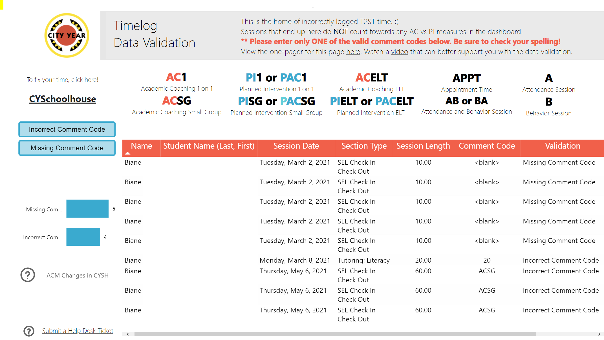

# Links to Bookmark

<body><h3 style="background-color:darkturquoise;"><c style=color:white;">March - June</h3></body>

### CYconnect

>- Download [CYConnect Home](https://cityyear.sharepoint.com/SitePages/Home.aspx)
>- Download [Power BI Home](https://app.powerbi.com/home)

## Office 365

Before the close of the year, we need to confirm that all time entry in ELT, T2ST and T1ST has been backlogged and is up to date. We don’t want an ACM to graduate with a week’s left of T2ST not backlogged. PMs should work with their teams to confirm the following:

- All time entry has been completed and is happening in real time as of May
- Time entry errors are being corrected; Any records shown on the Data validation page shown below may need correcting.

