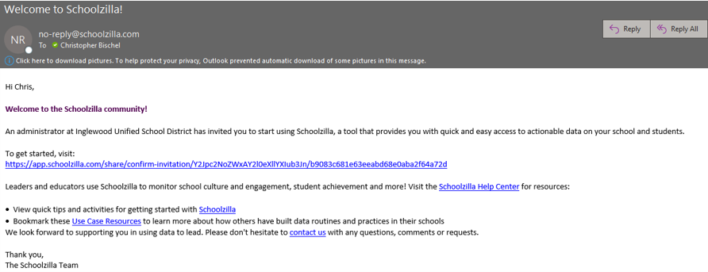
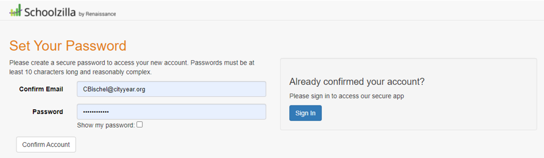
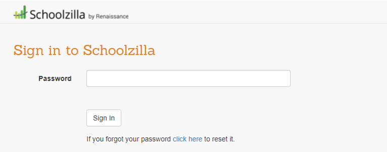
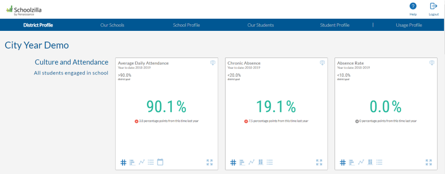
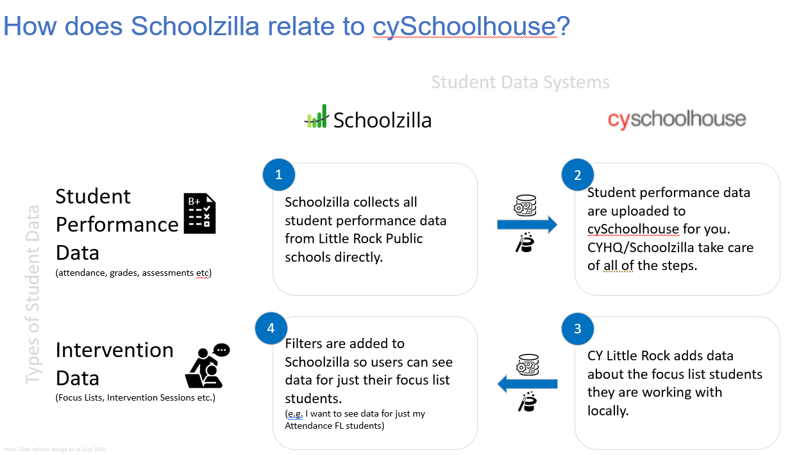

# Schoolzilla by Renaissance

## Schoolzilla Table of Contents

>- [What is Schoolzilla Mosaic?](#Schoolzilla-Mosaic-Explained)
>- [Creating Your Account](#Account-Creation)
>- [Using Mosaic](#Using-Mosaic-to-View-Student-Data)
>   - [District Profile](#District-Profile-Overview)
>   - [Our Schools](#Our-Schools-Overview)
>   - [School Profile](#School-Profile-Overview)
>   - [Our Students](#Our-Students-Overview)
>   - [Student Profile](#Student-Profile-Overview)
>- [Mosaic Resources](#Mosaic-Resources)

## Schoolzilla Mosaic Explained

**Renaissance Learning** is a global reading and math solutions ed-tech company working in K-12. They use data to support student learning in ELA and Math with a host of digital assessments, reading and curriculum platforms. 

**Schoolzilla** is a public benefit company with a mission to enable people to use data to improve educational outcomes for students. Together these two companies work on education technology solutions for educators across the country. One of these solutions is the student information system called **Mosaic**.

City Year is partnering with Schoolzilla to improve our existing student performance data systems and to augment our reporting and data integration services using the Schoolzilla Mosaic platform.

In Los Angeles Inglewood Unified as graciously allowed us to have access to their instance of Schoolzilla Mosaic. This access will hopefully help us make better informed decisions around student interventions because IUSD tutors and staff will be able to view data on their focus lists more regularly that with previous technology partners and processes.

Mosaic has a possibility to be a great option to augment and enhance City Years existing Ed-Tech tools (Cyschoolhouse, Power BI and CYConnect). continue to the sections below to learn how to use Mosaic to view student data.

The sections below will provide much more detail about Mosaic account creation and how to use the site. For those who want a quick overview see the [2 minute Tour of Mosaic](https://soapbox.wistia.com/videos/lAtySx05U3) video or the [Quick Start Guide](https://support.schoolzilla.org/hc/en-us/articles/360041206511-Quick-Start-Guide-for-Teachers) for teachers.

<iframe src="https://player.vimeo.com/video/45662127?h=c1dc3d0436" width="640" height="360" frameborder="0" allow="autoplay; fullscreen; picture-in-picture" allowfullscreen></iframe>

For more City Year context and a detailed walkthrough see the resources below.

## Account Creation

In order to get access to Schoolzilla Mosaic you must first be given an account creation link via email from Schoolzilla. If you need access to Schoolzilla Mosaic and have not created your account please contact your site Analytics Point Chris Bischel (Cbischel@cityyear.org).

The email to access your account will come from "No-reply@schoolzilla.com" and should have a getting started link to activate your account.

Once you click on that link you will be asked to create your password. Your username should be your CityYear email but you can set your password as anything you like.

After you set your password you can then log into Mosaic to use the site. If you forget your password you can always return to the login screen and reset your password via the reset link below the password prompt.

Once you sign in with your username and password you will be taken to the district profile homepage for Mosaic. If you are a corps member, manager or director you should be able to view aggrigated district level data to see how your school/students compare to all students overall. From here you can navigate around Mosaic to view data on the district, schools and groups of schools in aggrigate. If you want to see specific data on students you need to navigate to the "Our Students" and "Student Profile" sections explained below.

## Using Mosaic to View Student Data

There are five main pages in Mosaic for viewing student data. The first three (district profile, Our Schools, School Profile) contain aggragated data for students so that an administrator, teacher or tutor can see the big picture. The other two views (Our Students, Student Profile) provide individual student data to make decisions about what students need for intervention. Read the sections below to read more about each page.

>   - [District Profile](#District-Profile-Overview)
>   - [Our Schools](#Our-Schools-Overview)
>   - [School Profile](#School-Profile-Overview)
>   - [Our Students](#Our-Students-Overview)
>   - [Student Profile](#Student-Profile-Overview)

## District Profile Overview

The District Profile view give you a glance at how the district is doing overall. This page gives context for how students are doing overall at the district for each card of data like enrollment, attendance, behavior and course performance. The video below provides a quick walkthrough of how to use this page.

<iframe width="640" height="360" src="https://web.microsoftstream.com/embed/video/910e26c9-a954-44f8-af98-e06ad561b2e8?autoplay=false&showinfo=true" allowfullscreen style="border:none; position: absolute; top: 0; left: 0; right: 0; bottom: 0; height: 100%; max-width: 100%;"></iframe>

### District Profile Use Cases

The District Profile can give some good baseline comparsions for average data points like student attendance and behavior that may be informative to goal setting with focus list students. It can also be helpful for development in grant writing and demographics reporting on the students we are serving in the classroom.

## Our Schools Overview

Like the District Profile view this page contains aggregated student data by school useful for school comparisons within the district. You can sort and filter the page to see specific subgroups of students and compare whole schools in attendance, behavior and course performance. For more information on this page see the video below.

<iframe width="640" height="360" src="https://web.microsoftstream.com/embed/video/891f5756-8993-4e2b-b5aa-56a5227f8a86?autoplay=false&showinfo=true" allowfullscreen style="border:none; position: absolute; top: 0; left: 0; right: 0; bottom: 0; height: 100%; max-width: 100%;"></iframe>

### Our Schools Use Cases

The Our Schools page allows us to make comparisions between our school/students and other schools. When split by grade level this can be particularly useful for goal setting and context. It is also handy for seeing the highest performing schools and student subsets to give further information for goal setting and context for student performance overall.

For more resources on how to use the Our Schools page see the bullets below:

>- [Our Schools: How to find best practices across schools](https://support.schoolzilla.org/hc/en-us/articles/360037489511-Our-Schools-How-to-find-best-practices-across-schools-video-)

## School Profile Overview

The School Profile view allows you to see a single school and the associated student performance data in each tile. This page lets you compare your student performance data to the whole school or break down school data by specific demographics like grade, gender etc... 

See the video below for a walkthrough of how to use this page.

<iframe width="640" height="360" src="https://web.microsoftstream.com/embed/video/1d117588-5343-4075-9d7c-305a5b88c6f6?autoplay=false&showinfo=true" allowfullscreen style="border:none; position: absolute; top: 0; left: 0; right: 0; bottom: 0; height: 100%; max-width: 100%;"></iframe>

For additional resources on the use and navigation of school profiles see the bullets below:

>- [School Profile: How to review school trends](https://support.schoolzilla.org/hc/en-us/articles/360037761171-School-Profile-How-to-review-school-trends-video-)

### School Profile Use Cases

If you want to learn more about your school at the start of the year or how studnet performance is changing over time at your school this is a great place to start. If you interact with the tiles you can change the views to see specific information like chronic absence by whole school, gender, ethnicity, grade level and more to find patterns in the data. You can also expand cards and view the data for multiple years if it is available.

## Our Students Overview

The next two sections are most applicable for corps members and program staff given that they contain student level data. The Our students page will only show you data on your whole school and/or focus list so that you can see how students are performing in attendance, behavior, course performance and on assessments. This page also has some great grouping features that allow you to make custom groups of students for focus list selection, student interventions and more. See the video below to learn about how to use this page.

<iframe width="640" height="360" src="https://web.microsoftstream.com/embed/video/e233f73a-4581-4b2f-aeb8-fa70e5098d1e?autoplay=false&showinfo=true" allowfullscreen style="border:none; position: absolute; top: 0; left: 0; right: 0; bottom: 0; height: 100%; max-width: 100%;"></iframe>

For additional resources on how to use the Our Students view to identify students who may be a good fit for a focus list see bullets below:

>- [Find At Risk Students video](https://support.schoolzilla.org/hc/en-us/articles/360025941212-How-find-students-who-are-at-risk-based-on-multiple-indicators-contains-video-).
>- [Finding Similar Students for Interventions](https://support.schoolzilla.org/hc/en-us/articles/360034928751-Our-Students-Finding-similar-students-for-interventions-filtering-and-sorting-)
>- [Student Intervention Groups](https://support.schoolzilla.org/hc/en-us/articles/360026230751-Our-Students-Student-intervention-groups-video-)
>- [Creating a student intervention group](https://support.schoolzilla.org/hc/en-us/articles/360024572052-Our-Students-Creating-a-Student-Intervention-group-contains-video-)

## Student Profile Overview

The student profile page allows you to dive deep into current and historical student performance to see overall and class by class breakdowns of how a student is performing. This page gives you a broad picture of studnet performance and is great to use for planning during the course of the year, in goal setting with students and monitoring progress towards on track goals. See the video below for an overview of this page.

<iframe width="640" height="360" src="https://web.microsoftstream.com/embed/video/7462ee12-1d65-421c-9134-389812840144?autoplay=false&showinfo=true" allowfullscreen style="border:none; position: absolute; top: 0; left: 0; right: 0; bottom: 0; height: 100%; max-width: 100%;"></iframe>

For additional videos and resources for the student profile view see the bullets below:

>- [Student Profile: Understanding individual student performance ](https://support.schoolzilla.org/hc/en-us/articles/360034545792-Student-Profile-Understanding-individual-student-performance-video-)
>- [Student Profile: How to Review Course Failures and Grades](https://support.schoolzilla.org/hc/en-us/articles/360032497652-Student-Profile-How-to-Review-Course-Failures-and-Grades-contains-video-)

## Mosaic Resources

The links below are directly from Schoolzilla Mosaic help center and are a great place to start for self directed learning. If you wish to learn more about Mosaic and the data found in each page this is a great place to start. Stay tuned for more resources to be posted below in the near future.

>- [Introduction to Schoolzilla](https://support.schoolzilla.org/hc/en-us/articles/360034143572-Introduction-to-Schoolzilla-Video-)
>- [Quick Start Guide for District or School Leaders](https://support.schoolzilla.org/hc/en-us/articles/360036428891-Quick-Start-Guide-District-or-School-Leader)
>- [Student Profile: Understanding individual student performance](https://support.schoolzilla.org/hc/en-us/articles/360034545792-Student-Profile-Understanding-individual-student-performance-video-)
>- [Our Students: Finding similar students for interventions](https://support.schoolzilla.org/hc/en-us/articles/360034928751-Our-Students-Finding-similar-students-for-interventions-filtering-and-sorting-)
>- [Student intervention groups](https://support.schoolzilla.org/hc/en-us/articles/360026230751-Student-intervention-groups-contains-video-)

Schoolzilla is a suplement to City Year data systems and helps to automate processes behind the scenes like data submissions, student records and error checking. See the graphic for an example of what new processes Schoolzilla is helping to take on. The key thing to note here is that City Year will still use CYSchoolhouse for data collection and Power BI for data visualization in addition to Schoolzilla Mosaic.

For any other questions and feedback please contact your CYLA analytics point Chris Bischel (Cbischel@cityyear.org).

