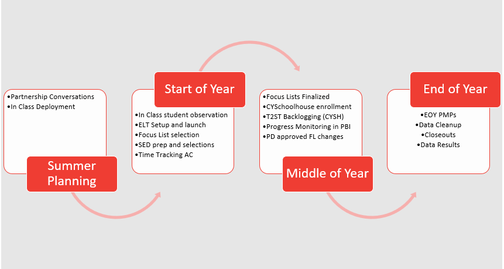

# Overview by Quarter

The Analytics team has quite a bit of items that need action by Program Directors, Program Managers and corps members. While the Analytics team does provide recommended windows for when these items should get done it is your job as a manager to set your own timelines and processes for each item. If for example your team cant be deployed into classes by Late July due to changing partner teachers then change your deadline on that action item by notifying your program director.

These checklists and dates are more important to follow in the correct **SEQUENCE** than in the right window of time. If you have questions or want to make edits to anything here you can always talk things over with your director or a member of the Impact Analytics team.
