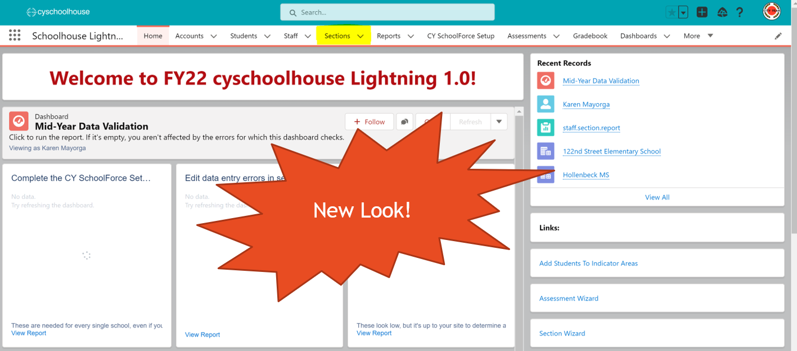

# Managing Cyschoolhouse (CYSH)

The Impact Analytics will take care of the initial set-up for CYSH for each school. This includes **creating ELA, Math, and SEL sections for each ACM for every school and the initial enrollment of final focus list students in November**. After this initial enrollment process, Program Managers are expected to manage their ACM's sections thereafter. 


Program managers will be expected to validate, mange any changes needed in the future, and add indicator areas for all final focus list students. PMs may create their own process for identifying, validating, and managing changes or may use their focus list workbooks, as shown below. The process for managing focus list changes is up to PM's discretion, but we do ask that sections be updated frequently.(At least 1x a week or as soon as changes occur.)

**Jump over to the information you need:**

> - [Manage Focus List Students](#Optional:-Managing-FL-Changes-Using-the-Focus-List-Workbooks)
> - [Validating Focus Lists](#Validating-Focus-List-Caseloads)
> - [Accessing & Creating Custom Views](#Accessing-CYSH-&-Creating-New-Views)
> - [Adding Students to Sections](#Adding-Focus-List-Students)
> - [ Removing Students from Sections](#Removing-Focus-List-Students)
> - [Adding Inidicator Areas](#Adding-Indicator-Areas)

### Optional: Managing FL Changes Using the Focus List Workbooks

- Each Focus List Workbook has an **FL Changes** Tab
- ACMS can use columns 3-11 to identify the student(s), the change they need, the section they are located in, and the drop or enrollment date
- PMs can use column 12 to keep track of their actions: pending, approved, complete, denied

<p align="center">

</p>

## Validating Focus List Caseloads

>   - Do ACMs have the number of expected active FL students in each section?
>   - Do new students **meet the focus list criteria**?
>     - Students in 3rd grade – 9th grades
>     - Students that are at risk for falling behind
>     - ***Students are not on another ACM’s focus list***
>   - Removing students from a focus list must have a valid reason:
>     - Student moved classes
>     - Chronic absenteeism
>     - Student left the school
>   - Do all final focus list students have an **indicator area**?

## Cyschoolhouse Updates
In FY22, the entire organization swtiched from Salesforce Classic to Salesforce Lightning. This means that CYSH might look different from what you have seen in the past years, so we have updated our training content and included additional training material to help you navigate this new interface. If you have any questions or experience any issues, please contact someone on the IA Team. 



## Accessing CYSH & Creating New Views

Managing your ACM's CYSH sections can be made easier by custominzing your view of their sections. The document below will walk you thourgh creating your own custom view.

```pdf
   files/CYSH_Access_Custom_View.pdf
```

## Adding Focus List Students

```pdf
   files/CYSH_Enrolling_Students.pdf
```

## Removing Focus List Students

```pdf
   files/CYSH_Withdrawing_Students.pdf
```

## Adding Indicator Areas

Indicator areas are an imporant part of gathering our student data. The Indicator Area flags students as focus list students and allows their information to be uploaded onto the DESSA Aperture site. Students without and inidicator area will not show up on the Aperture Site.

```pdf
   files/CYSH_Adding_Indicator_Area.pdf
```