# Managing CYSH

Caseload changes via cyschoolhouse will be managed by program managers after Impact Analytics goes through the initial enrollment process. Program managers will then validate and mange any changes needed thereafter. Program managers may create their own process of identifying, validating, and managing changes or may use their focus list workbooks. Program Managers will also need to add indicator areas for all final focus list students.

### Managing FL Changes Using the Focus List Workbook:

- Sections/columns X-X were created to help with caseload management
- ACMS can use column X to identify students that need to be added or removed from a caseload
- PMs can use column X to keep track of their actions
- Columns X are there to assist

### Validating Focus List Caseloads

> - New students must meet the focus list criteria:
>   -  Students in 3rd grade – 9th grades
>   - Students that are at risk for falling behind
>   - ***Students that are not on another ACM’s focus list***
> - Removing students from a focus list must have a valid reason:
>   - Student moved classes
>   - Chronic absenteeism
>   - Student left the school

## CYSH Section SetUp

### Tier 2 Support Time (T2ST)

The Impact Analytics Team will create sections for **ELA, Math and SED** for every ACM at each school. If you notice any issues with your team's sections or do not see them, please contact the IA Team: kmayorga-pasillas@cityyear.org

The IA team will also do an initial pass at enrollment for final focus list students when workbooks are completed. After the initial enrollment pass done by the IA team, program managers will manage any additions that need to be made thereafter.

> 1. ACMs make final focus list and SED selections in the focus list workbook
> 2. PMs validate the focus list workbooks
>    - Do the students fall into the correct grade levels? (3rd grade – 9th grade)
>    - Are there any duplicate selections?
>    - Does every ACM have 11 FFLs (5 for TLs)?
>    - Does every ACM have 6 SED students?
> 3. Inform IA team that selections have been finalized and validated via email to kmayorga-pasillas@cityyear.org CC cbischel@cityyear.org
> 4. IA will role this initial list of students for each school
> 5. Program Managers will then manage their team’s CYSH sections
>    - Students that need to be added
>    - Students that need to be removed
>    - Later, indicator areas

### Tier 1 Support Time (T1ST)

Teams are given the option to track time spent supporting students that is not Tier 2 Support Time (T2ST) or Extended Learning Time (ELT). Examples of this might include, time spent making phone calls home, time spent facilitating whole class activities, or time spent supporting students during teacher office hours. 

Program Managers should begin thinking about whether they would like to track any Tier 1 Support Time (T1ST) for their schools and what approach would be best fitting.

>- **Approach 1:** track by grade level to be able to select any student in that grade
>   - Best approach if your team will be supporting in making phone calls home to students in the school.
>- **Approach 2:** track by classes to be able to select all students from a particular class to enter time for whole class support
>   - Best approach if your team will be consistently participating in whole class activities and support.

Program Managers can select their preferred approach if applicable, via their school’s Deployment Workbooks by selecting if they want an ACMs class to be configured for T1ST by creation of a subject specific T1ST section.

**Include screenshot of the workbook & how they would make these selections** (IA Team)

## Add/Removing Students to Sections

1. Go to CYSH by clicking the cyschoolhouse tile in your [Okta homepage](https://cityyear.okta.com/app/UserHome)

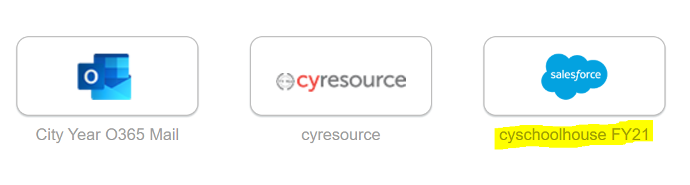

2. Click on the 'Setions' tab to locate the section needed

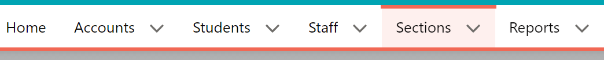

3. On the top right-hand corner, find and select 'Section Intervention Data'

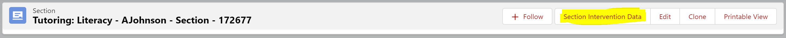

### Withdrawing Students

- Select the student(s) to remove by clicking on the checkbox next to their names. *You may select multiple students at a time*

- Using the ribbon, select 'Withdraw Student(s)

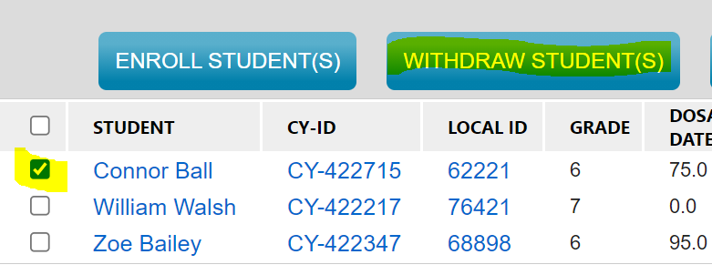

- In the new window, select an ***Exit Date***, if different from today, and and ***Exit Reason***.

- Click 'Save'

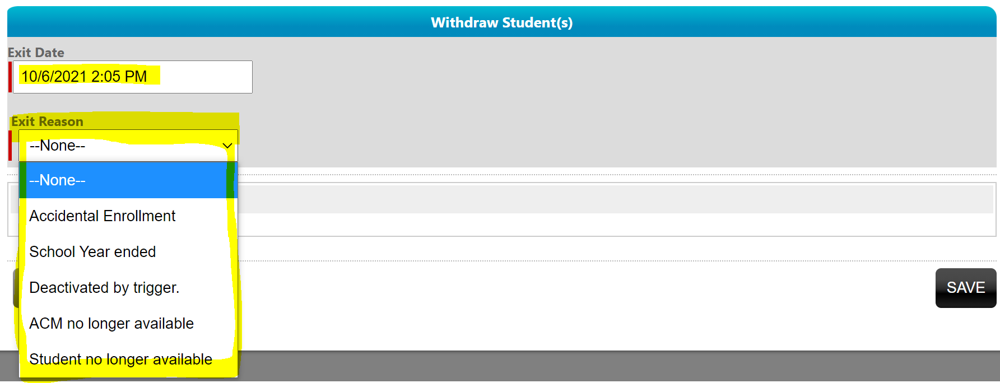

### Adding Students

- Using the ribbon, select 'Enroll Student(s)'

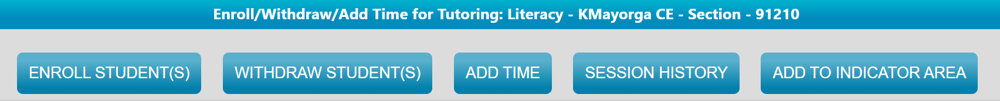

- Enter an enrollment date. ***Should be the 1st day the student started recieving services***

  - Students with different enrollment dates will need to be enrolled separately.

- Use the 'All Grade Levels' filter to filter to the student(s)' grade levle

- Then use the 'Alphabet' filter to filter the names to the student(s)' FIRST NAME

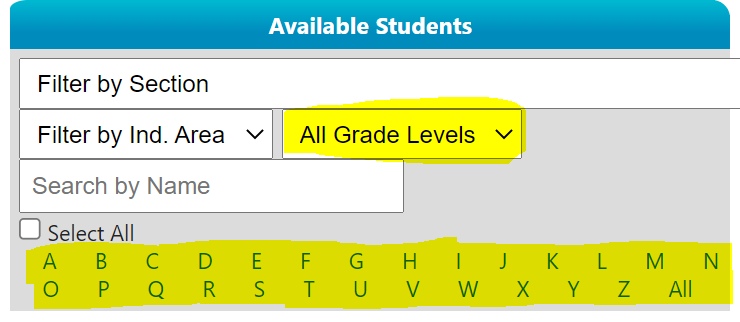

- Select your student(s) in the left pane, then use the right arrow on the screen to move them to the right pane.

  - Repeat this step until all student(s) have been selected

- Once all students have been selected and validated, click Save.

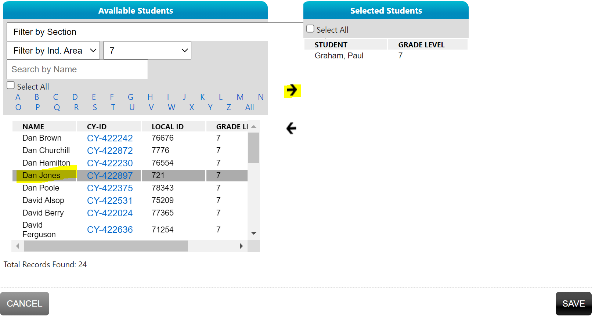

## Indictor Areas

Indicator areas are used by HQ to identify focus list students. Students that do not have an indicator area assigned to them, will not be counted in any end of the year reports created by HQ. It is vital that students get assigned indicator areas for this reason, else senior leaders will see inaccurate data for our site. Follow the step-by-step guide below to add indicator areas:

- Open [CYSH](https://cityyear.okta.com/home/salesforce/0oa1itg0i12uHbL4V0h8/46?fromHome=true) in your browser
- Go to the 'Sections' tab in the blue ribbon
- Open a section in ELA, Math or SEL (*Note: indicator areas are only assigned in these sections not in ELT)
- Select all students by clicking on the box at the top-left corner

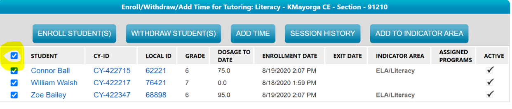

- Click on the ‘Add To Indicator Area’ button on the top

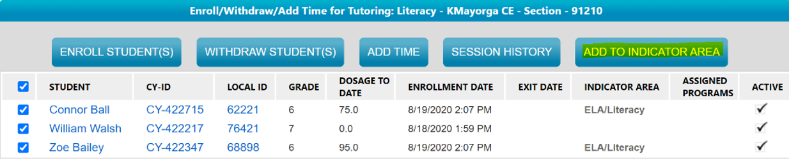

- Enter the Effective Date: should match the enrollment date
- Click Save

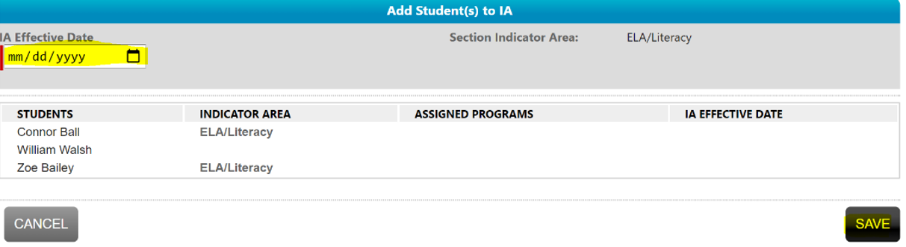

