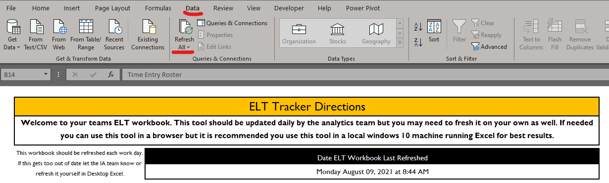

# Extended Learning Time

Extended Learning Time is no small portion of the corps member experience! While we dont want to add extra unessisary work on top of an already long day there are some key things that need to be done and tracked in ELT to keep your students safe and ensure that all of our partners and governmental obligations are being met. To that end we are making some changes to ELT processes in FY22 in the hopes to reduce the workload of managing ELT. See the basic checklist below for a review of the needed actions for ELT data management. 

## Key Links for ELT

>- [ELT Workbooks on CYconnect](https://cityyear.sharepoint.com/teams/lax/LaxPrivate/LAProServe/Pages/My-Progress-Monitoring.aspx)
>- [Ongoing ELT FAQ](https://cityyear.sharepoint.com/:w:/r/sites/LAC-ACM-SeniorCorps/Shared%20Documents/Senior%20Corps/FY23/FY23%20ELT/FY23%20ELT%20Data%20Management%20FAQ.docx?d=w93c25554d06d459686c7be27712fe290&csf=1&web=1&e=iKFtXf)
>- [Senior Corps ELT Library on CYconnect](https://cityyear.sharepoint.com/:f:/r/sites/LAC-ACM-SeniorCorps/Shared%20Documents/Senior%20Corps/FY23/FY23%20ELT?csf=1&web=1&e=ElQnT3)
>- [Template ELT Applictions in English and Spanish](https://cityyear.sharepoint.com/:w:/r/sites/LAC-ACM-SeniorCorps/Shared%20Documents/Senior%20Corps/FY23/FY23%20ELT/FY23_After%20School%20Participation%20Form_English_Spanish%20Final.docx?d=w0b3d818d99814085848ae63c0bc10e57&csf=1&web=1&e=YAUBER)
>- [ELT Data Management Session Recording](https://web.microsoftstream.com/video/5362e60f-c338-488f-aaa2-098aeab6ac7b)
>- [ELT Data Management Session PPT](https://cityyear.sharepoint.com/:p:/r/sites/LAC-ACM-SeniorCorps/Shared%20Documents/Senior%20Corps/FY23/FY23%20ELT/ELT%20Data%20Management/FY23%20ELT%20Data%20Management%20Overview.pptx?d=we81f212cdf9949e5a4d74e837b3d729f&csf=1&web=1&e=2wrOlm)

## Checklist for ELT Workbook Tasks

The Items below are tasks that team leaders should regularly complete to ensure ELT data is properly managed.

>- [ ] Team Leaders collect all ELT applications and digitize their records in the “ELT Applications” page of the ELT Roster.
>   - All fields in orange must be present before a student can attend ELT.
>   - Incomplete ELT applications should be sent back home with students.
>- [ ] Team Leaders build out a list of students who are attending your ELT program on the “Print Roster” and "Time Entry Roster" pages of your ELT workbooks.
>   - Don’t forget to match student names up between the name coming from the “Student Records” page and the “Paper Applications” page. This helps you ensure all students in your program have a completed application!
>- [ ] Team Leaders record all student time in and time out is recorded in the “Time Entry Roster” page of the ELT workbook.
>   - This helps us communicate to partners how many students are in our after school program and answer questions about student attendance, arrival and departure.
>- [ ] Team Leaders work with PMs to periodically review ELT Dashboards to make improvements to programming.
>   - Reviewing "Dashboard" page, submitted ELT applications, Focus Lists in ELT and other key metrics.
>- [ ] Talk to the Impact Analytics questions when you have:
>   - Questions about ELT data tasks
>   - Issues with workbooks
>   - Feedback for tool improvement
>   - Data isn’t refreshing properly
>   - (zlatade@cityyear.org)

<body><h3 style="background-color:orange;"><c style="color:white;"> ELT Data Management </h3></body>

### What are we doing again with ELT Workbooks?

City Year needs to make sure that we get guardian consent for any student participating in after school. City Year also needs to ensure that when students come to our program that we are keeping track of the **total time** they spend in our program so that we can report to guardians, school partners and external partners the scope of our program overall and individual student participation. In prior years we would do this by using CYSchoolhouse to track total time in ELT but student records might have been missing and the extra steps in using CYSchoolhouse complicated the work. In FY23 we are trying to reduce the workload of ELT data processes and comply with new expectations from our districts to track ELT time only in Excel. Each team should be given at least one Desktop computer that will allow you to use your ELT workbooks in Excel but if you have tech challenges please let the Analytics team know.

**Team leaders** are responsible for making sure data processes happen for their school as outlined in the five items below:

1.	Printing and distributing ELT applications to students in English and Spanish.
2.	Digitizing returned ELT applications and ensuring all key application fields are properly filled out
3.	Building out ELT print rosters and/or keeping ELT time tracking up to date weekly in Excel
4. Ensuring time entry happens accurately for all students in Excel in a timely manner.
5. Reviewing ELT data for your school and seeking to improve your program.

The ELT workbooks will help you complete these tasks and hopefully with a combination of resources, videos and regular office hours with Analytics we can get a regular cadence going to make this work easy.

For a high level review of these processes see the video below.

<iframe width="640" height="360" src="https://web.microsoftstream.com/embed/video/83e0e6d8-d571-4be1-87ff-eb371214f11c?autoplay=false&showinfo=true" allowfullscreen style="border:none; position: absolute; top: 0; left: 0; right: 0; bottom: 0; height: 100%; max-width: 100%;"></iframe>

### The Purpose of ELT Time Tracking

To do all the five steps above means you as a team leader may need to carve out time in your day to keep data entry for applications and attendance time up to date. Work with your PM and team to identify times and processes to make sure these tasks happen regularly. The reason this is important is because of some of the scenarios described below that can only be answered by keeping ELT data up to date:

1.	Partner teachers giving extra credit for student attendance
2.	Parent/guardians wanting proof of student ELT attendance
3.	Liability waivers to confirm/deny student attendance in case of incidents
4.	Partners wanting us to quantify the size and scope of our after school programming
5.	Funders and grants seeking to support and grow after school programs
6.	Evaluation of our work to determine if ELT supports student academic growth

For these reasons we ask that every school ensure all students have a submitted ELT application on file with guardian consent, that students and corps members track student time in/time out and total minutes each day in the program and that all this data is entered in ELT workbooks on Cyconnect so that this data can be viewed centrally for the needs of partners and the site.

See below for a walkthrough of each part of the ELT data management process.

### ELT Applications (Every Student Needs One)

As part of our data agreement with LAUSD all students will need to have an ELT application on file **BEFORE** attending after school programming in FY23. If a student attends ELT without an application City Year runs the risk of being sued if anything happens to the child while they are in the care of City Year (This has happened in the past). Additionally if there is a medical emergency with a student we need to know who to contact or if they have medical insurance.

To ensure that we are protecting ourselves legally AND that we are keeping students safe by having emergency contact information on hand for our students we will need all students to have an ELT application and to have that application digitized into the ELT workbooks on Cyconnect. The Students App status should be listed as "Complete" before they are allowed to attend the program.

To learn more about the applications data entry processes see the video below. 

<iframe width="640" height="360" src="https://web.microsoftstream.com/embed/video/ba9726e1-8a1f-4a5d-b145-0e1d442e8376?autoplay=false&showinfo=true" allowfullscreen style="border:none;"></iframe>

For an alternate method of inputting ELT form data that may save you time when using Desktop Excel see the optional video below.

<iframe width="640" height="360" src="https://web.microsoftstream.com/embed/video/802faf3d-c99e-4dcd-93f8-69d8eb5a54b1?autoplay=false&showinfo=true" allowfullscreen style="border:none;"></iframe>

### Student Records

When you enter a students ELT application you want to see if the parent/guardian provided a student ID. In many cases they will not and you will need to check the student’s name and grade against our “Student Records” table. This is a list of students from the classes we serve in that will be loaded into your ELT workbooks around September when the district provides CYLA with student enrollment information.

If you are unable to find the students ID you can “make up” an ID for the student until such a time that you can find the students real ID and update it on the ELT application.

You will want to periodically check and update student IDs to prevent creating duplicate student records. Note that student records can come from two places: Either the ELT applications you are typing into the workbook or the five column roster enrollment reports from the schools. It is possible student records can be duplicated from both applications and the student enrollment which would cause duplicates. Team leaders should look for duplicate records and update them to use the "Five Column Rosters" student name and ID if it is available.

See below for a full video on the Student Records page.

<iframe width="640" height="360" src="https://web.microsoftstream.com/embed/video/6adfee81-1620-4062-9eb6-618bc0ed2f0b?autoplay=false&showinfo=true" allowfullscreen style="border:none;"></iframe>

### Print Roster

The ELT print roster is designed to be a template to print pre-populated attendance trackers for ELT. We recommend you use paper trackers to physically track time with students but if you prefer to enter ELT time directly into the “Time Entry Roster” page you can opt out of printing rosters weekly.

Note that to use the Print Roster you will need to select ACMs and Students from the dropdowns on the roster and update the dropdown for the given week to keep the dates matching for the given week. For a full overview video on the Print Roster page see below:

<iframe width="640" height="360" src="https://web.microsoftstream.com/embed/video/cf216575-20d0-40a2-b624-e2e285e7b54a?autoplay=false&showinfo=true" allowfullscreen style="border:none;"></iframe>

### ELT Entry Roster

If you have done the previous steps of entering student ELT applications, updating the “student records” page, filled out the optional print roster and begun your ELT program you are ready to start tracking ELT attendance time with students. Like the print roster page you will need to fill out the students who will be attending ELT, as well as do some name matching between the student records and ELT applications page to ensure no duplicate students. Once your student info has been put in Columns B:D then you are all set to record time in an time out with students.

Note that there is a field for each day titled "Pilot Min." which is for schools conducting pilot programming like STEM to the future. If your school is not running a pilot program you can always leave this field blank.

Once a given day has been **fully backlogged** you can hide the columns from that day to keep the Time Entry Roster focused on future days. For a full video walkthrough of this page see the video below.

<iframe width="640" height="360" src="https://web.microsoftstream.com/embed/video/d38538e7-6e61-472f-9e2f-cab77c76ef59?autoplay=false&showinfo=true" allowfullscreen style="border:none;"></iframe>

### ELT Data

Once you enter data into the “Time Entry Roster” you can go to the ELT data page and load in cleaned data that will give you useful information about your ELT program. Analytics should refresh this page once a day but if you need to update it sooner you can do so by opening the ELT workbooks in a desktop version of Excel and clicking on the refresh all button. 

For a full video walkthrough of the ELT data page see the video below.

<iframe width="640" height="360" src="https://web.microsoftstream.com/embed/video/7dd40456-58d7-4fc9-b947-1c0ffad7729a?autoplay=false&showinfo=true" allowfullscreen style="border:none;"></iframe>

### ELT Dashboard

After all other processes have been completed and all tables have been refreshed then you can view your programs ELT data. The ELT Dashboard gives a program overall and ACM by ACM view of some key ELT metrics. For a full walkthrough of the dashboard the video below.

<iframe width="640" height="360" src="https://web.microsoftstream.com/embed/video/b4b32455-5b57-44c2-b678-b165cd9c6cc9?autoplay=false&showinfo=true" allowfullscreen style="border:none;"></iframe>

See the table below for a description of each of the metrics on the ELT workbook Dashboard page.

|                   Fields                   |                                                                                                                                                                                         Notes                                                                                                                                                                                         |   |   |   |   |   |   |   |   |   |
|:------------------------------------------:|:-------------------------------------------------------------------------------------------------------------------------------------------------------------------------------------------------------------------------------------------------------------------------------------------------------------------------------------------------------------------------------------:|:-:|:-:|:-:|:-:|:-:|:-:|:-:|:-:|:-:|
|                     ACM                    | Active   corps members deployed to a given school should load in this report. The   blank cells below are placeholders for mid years and teams of various sizes.   Every student should be assigned a corps member to ensure data for your   program will roll up under an ACM. If students are not assigned to an ACM   their data will still populate in the ELT overall Column     |   |   |   |   |   |   |   |   |   |
|               # ELT Students               | This   represents the number of students enrolled in your ELT program based on being   present on the "Time Entry Roster" page of this workbook.                                                                                                                                                                                                                                      |   |   |   |   |   |   |   |   |   |
|            # Active FL Students            | This   number may not populate until late November based on when your team completes   the focus list process. Active ELA/Math focus list students enrolled in a   CYSchoolhouse section will be pulled in to calculate the number of active   focus list students an ACM has in class. If this seems off confirm with your   PM and notify the Analytics team.                       |   |   |   |   |   |   |   |   |   |
|             # Active FL in ELT             | This   number is the number of active focus list students (for said ACM) who have   attended ELT at least once. Unlike the previous "# Active FL   students" metric students need to attend ELT before being counted here.                                                                                                                                                            |   |   |   |   |   |   |   |   |   |
|                 % FL In ELT                | Dividing   the number of active focus list students by the number of active focus list   students who have attended ELT will yield the percent of focus list students   that have attended your ELT programming. Generally we like to prioritize   focus list students for after school as a way to overlap services and get   more instructional time with students.                 |   |   |   |   |   |   |   |   |   |
|             Total Hours in ELT             | The   total hours of ELT time that has been logged in ELT for all the students in   your ELT program. While we record total minutes in attendance it is easier to   understand total time in hours and is reported here in hours and decimal   portions of hours.                                                                                                                     |   |   |   |   |   |   |   |   |   |
|             Total ELT Sessions             | The   total sessions of ELT that have been logged in ELT for all students in your   ELT program. Any amount of time attended on a unique day will be counted as a   session.                                                                                                                                                                                                          |   |   |   |   |   |   |   |   |   |
|            Avg. Time Per Student           | The   total number of hours in ELT will be divided by the total number of students   to give an average amount of ELT hours per student. This gives a general   sense of how much cumulative time a student has spent in your ELT program.   The more consistently a student attends ELT the higher the average will be.                                                              |   |   |   |   |   |   |   |   |   |
|                   ELT ADA                  | This   metric takes the total days that your ELT program has recorded time with   students and divides it by the total sessions that students have recorded in   your ELT program. EG 240 sessions divided by the possible sessions that could   have been earned (20 students attending 20 possible days of ELT = 400   possible sessions. (Actual sessions/possible sessions = ADA) |   |   |   |   |   |   |   |   |   |
|               ELT ADA for FL               | This   metric takes the same logic as above but is filtered to only focus list   students for the given corps member. This metric will give you an average   daily attendance rate for an active focus list for that given ACM.                                                                                                                                                       |   |   |   |   |   |   |   |   |   |
| *Total Hours In Optional Pilot Programming* | This   is only for schools who are running pilot programs like STEM to the Future or   other curriculums that must be tracked separately than normal ELT attendance   time. Unless you are part of the ITAV pueblo or another school with pilot   programming you can ignore this column.                                                                                            |   |   |   |   |   |   |   |   |   |

### How to hide student records

Students may leave your ELT program, school or simply stop attending ELT. If you have recorded time with these students it is best to keep them on your rosters and 
simply hide them using the "Active" column on the "Time Entry Roster" page of your ELT workbook. See the video below for the details.

<iframe width="640" height="360" src="https://web.microsoftstream.com/embed/video/8b28c75d-c64f-44b2-ad8d-df540fd0b47e?autoplay=false&showinfo=true" allowfullscreen style="border:none;"></iframe>

### ELT Steps in Summary

The steps outlined above break down into the following short set of actions. Team leaders will regularly collect and digitize ELT applications in the provided ELT workbooks ensuring all information in orange is complete and accurate. Team leaders will then update the "Student Records" page with new unique students from the ELT applications page or from the schools student enrollment database from Analytics. Then Team Leaders will build out the ACM and student pairings on the Print and Time Entry Rosters and keep track of ELT attendance time on a regular basis. This ELT data will feed into the ELT Dashboards which will help PMs and TLs regularly review their ELT data for program improvements and quality assurance.

### ELT Roles

Below is a table that helps to clarify the roles of everyone in after school data management. While the program manager is ultimately the person who supervises all school based activities we view the Team Leader as the owner of most day to day extended learning time activities, logistics and execution. This is particularly true when it involves the data that is being managed for ELT.

Team leaders will be the people that Impact Analytics reaches out to when ELT applications need to be entered into the system, when student IDs need correcting, when time entry needs to happen more regularly and more. We hope to have regular check ins with team leaders to support them in all of these tasks moving forward.

|     Item                                            |     Program Manager    |     Team Leader    |     Corps Member    |
|-----------------------------------------------------|------------------------|--------------------|---------------------|
|     Conducts ELT programming                        |     Manager            |     Owner          |     Helper          |
|     Deploys and Collects ELT Applications           |                        |     Owner          |     Helper          |
|     Digitizes ELT Applications in Workbooks         |                        |     Owner          |     Helper          |
|     Fills out ELT Rosters on Workbooks              |                        |     Owner          |     Consulted       |
|     Prints ELT Rosters and/or Enters Time In/Out    |                        |     Owner          |     Helper          |
|     Reviews ELT Data regularly                      |     Manager            |     Owner          |     Helper          |
|     Validates data errors                           |     Manager            |     Owner          |     Consulted       |
|     Ensures a high quality ELT program              |     Manager            |     Owner          |     Helper          |

We understand that Team Leaders will not be present every day so we reccomend that team leaders identify one or two people on their team who can step in when team leaders are not present to particiate in ELT data management specifically with ELT applications and ELT time entry.

When Team Leaders have identified said ACMs who should have access to your schools ELT workbooks please notify Impact Analytics so that they can give these ACMs access.

### Further Support

If you have questions or need support with ELT data items please use the [CYLA Help Desk](https://cityyear.sharepoint.com/teams/lax/SitePages/CYLA%20Help%20Desk.aspx) or email Zack Latade (zlatade@cityyear.org). Additionally if there are other questions not answered here please feel free to add them to the bottom of the [ELT Data FAQ](https://cityyear.sharepoint.com/:w:/r/sites/LAC-ACM-SeniorCorps/Shared%20Documents/Senior%20Corps/FY23/FY23%20ELT/FY23%20ELT%20Data%20Management%20FAQ.docx?d=w93c25554d06d459686c7be27712fe290&csf=1&web=1&e=F30uiE) document.
