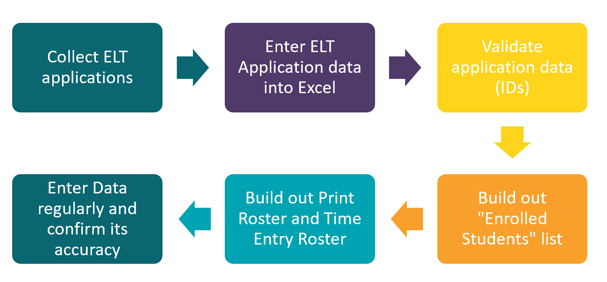

# Extended Learning Time

With a new data use agreement from both of our school districts in FY21 our after school data management processes need to undergo some changes. Additionally corps members have expressed how complicated tracking time in ELT has been so in FY22 the Analytics team is hoping to make some simplifications and improvements to ELT attendance tracking while **also adding some important steps** to comply with our new data agreements.

### ELT Roles

Below is a table that helps to clarify the roles of everyone in after school data management. While the program manager is ultimately the person who supervises all school based activities we view the Team Leader as the owner of most day to day extended learning time activities, logistics and execution. This is particularly true when it involves the data that is being managed for ELT.
Team leaders will be the people that Impact Analytics reaches out to when ELT applications need to be entered into the system, when student IDs need correcting, when time entry needs to happen more regularly and more. We hope to have regular check ins with team leaders to support them in all of these tasks moving forward.

|     Item                                            |     Program Manager    |     Team Leader    |     Corps Member    |
|-----------------------------------------------------|------------------------|--------------------|---------------------|
|     Conducts ELT programming                        |     Manager            |     Owner          |     Helper          |
|     Deploys and Collects ELT Applications           |                        |     Owner          |     Helper          |
|     Digitizes ELT Applications in Workbooks         |                        |     Owner          |     Helper          |
|     Fills out ELT Rosters on Workbooks              |                        |     Owner          |     Consulted       |
|     Prints ELT Rosters and/or Enters Time In/Out    |                        |     Owner          |     Helper          |
|     Reviews ELT Data regularly                      |     Manager            |     Owner          |     Helper          |
|     Validates data errors                           |     Manager            |     Owner          |     Consulted       |
|     Ensures a high quality ELT program              |     Manager            |     Owner          |     Helper          |

## ELT Proccess
### Applications
As part of our data agreement with LAUSD all students will need to have an ELT application on file BEFORE attending after school programming in FY22. If a student attends ELT without an application City Year runs the risk of being sued if anything happens to the child while they are in the care of City Year (This has happened in the past). To ensure that we are protecting ourselves legally AND that we are keeping students safe by having emergency contact information on hand for our students we will need all students to have an ELT application and to have that application digitized into the ELT workbooks on Cyconnect.
To learn more about the applications processes see [this video.]()

### ELT Workbooks

Part of the role of a team leader will be to ensure all ELT applications, student enrollment and time in and out is recorded daily on the Analytics provided Extended Learning Time Workbooks. The two main purposes of these ELT workbooks are to verify student ELT applications and to provide a space for tracking program attendance so that we can determine if our program is meeting our desired outcomes.
ELT workbooks should be available to team leaders in early August and specific trainings for team leaders will be upcoming. Come back for links to said trainings and resources later.

## ELT Data Entry and Roles Checklist

City Year Los Angeles After school supports students by extending the school day, providing space for enrichment activities and homework support. Our school partners, student guardians and organizational funders are keen to know how our after school programs are doing and this means we need to track some basic data on the students attending our enrichment activities. The items below explain the roles and tasks of tracking student attendance data for After school.

### ELT Role Clarity

In FY22 team leaders will be responsible for managing the collection and digitization of ELT applications from students at their school. Team Leaders should carve out some time each week to collect and organize ELT applications in an easy to access binder before digitizing them into their teams ELT Rosters in Excel. This is a new process for the 2021=2022 school year but necessary as our data agreements with LAUSD and IUSD have changed and we are now obligated to ensure every student has an ELT application on file that is tied to their student ID. Chances are that many students ELT applications wont have their ID when submitted so Team leaders will need to periodically go to school partners to collect any missing student IDs that Team leaders could not find on the “student records” page of the ELT workbook.

Additionally, this year team leaders will be responsible for printing out ELT attendance rosters to help ACMs sign students into and out of the program. Alternatively, team leaders can also just regularly enter attendance in and out time into the Excel workbooks “Time Entry” page. The choice between entering time on paper before backlogging it into the “Time Entry” page or just entering it during ELT is up to each school to decide. Sometimes schools with ELT in multiple locations prefer the paper method while other schools may find it best to just enter student time in and out directly into the spreadsheets.

Team leaders should work with their program managers to determine how to ensure all attendance time is being recorded with students each day. Reasons why tracking time in after school is so important is because City Year needs to be able to articulate to schools and guardians when students arrived and left our program, who might have picked students up from Elementary schools (Initials fields) and how often/much a student attended our program.

### Checklist for ELT Workbook Tasks
>- [ ] Collect all ELT applications and digitize their records in the “Paper Applications” page of the ELT Roster.
>   - Ensure that all fields in orange are present. If not send the application back. Students cant attend ELT until the application is complete.
>- [ ] Build out a list of students who are attending your ELT programming on the “Enrolled Students” page.
>- [ ] Don’t forget to match student names up between the name coming from the “Student Records” page and the “Paper Applications” page. This helps you ensure all students in your program have a completed application!
>- [ ] Build out the optional “Print Roster” and “Time Entry” pages with your enrolled students and associated corps member pairings.
>   - The ACM name next to the student record will help denote the ACM pod and/or room that a student occupies.
>- [ ] Ensure all time in/out is being recorded daily/weekly in the “Time Entry” page of the ELT workbook.
>    - This helps us communicate to partners how many students are in our after school program and answer questions about student attendance, arrival and departure.
>- [ ] Talk to the Impact Analytics questions when you have:
>   - Questions about ELT data tasks
>    - Issues with workbooks
>    - Feedback for tool improvement
>    - Data isn’t refreshing properly
>    - (Cbischel@cityyear.org)

## ELT Resources
place resources here