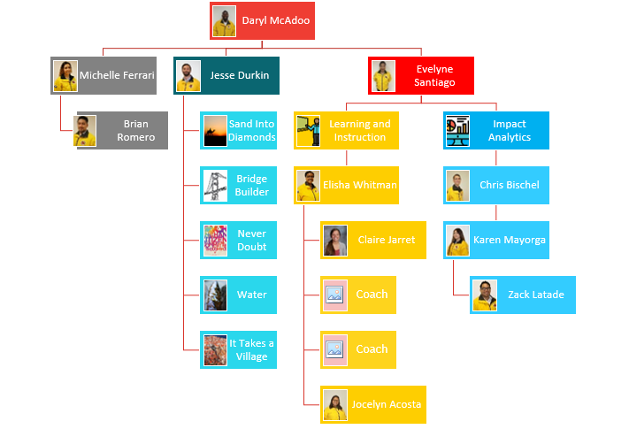

# Who is Impact Analytics?

Impact Analytics is a three-person team that makes up the broader Service Department at City Year Los Angeles. 

This three-person team builds tools, systems, and trainings to enhance our site use of data. The data we use could be to support delivery of student intervention, report key information to school partners or quantify the results of our overall program to our state commission. However, data is needed we hope to make it easy and meet your needs.

Our job is to support the service team in designing the service model locally, build great data tools for tracking student performance, administering surveys, supporting field-based staff in implementation and more. For more on what the analytics team does see the next section.