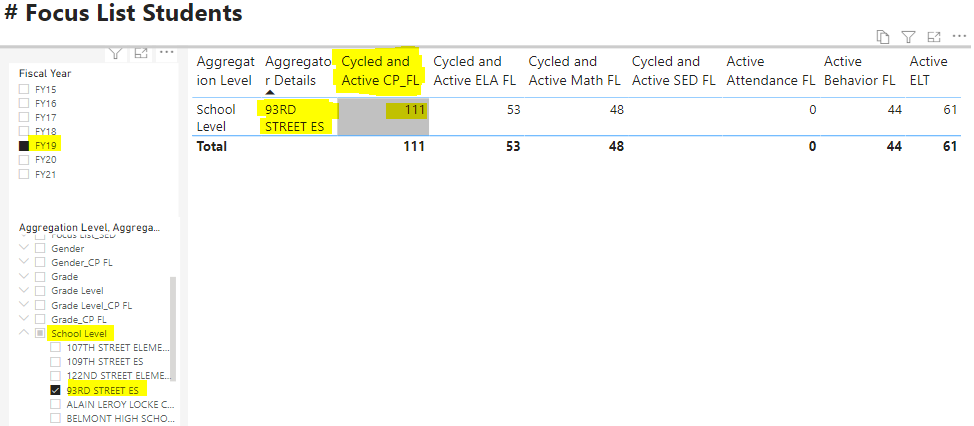
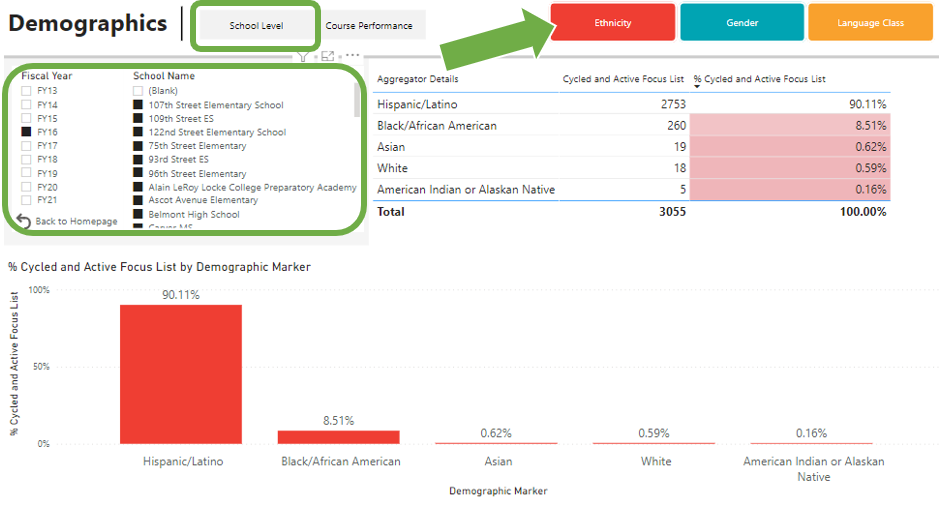
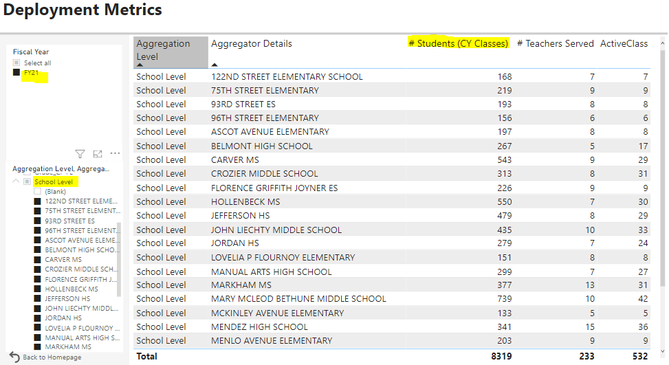
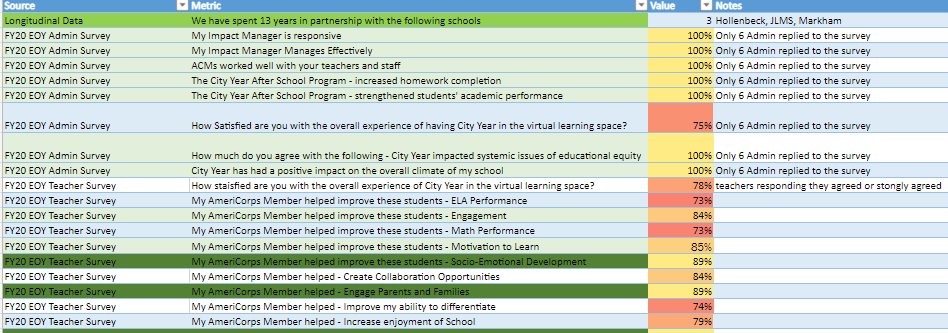

# CYLA Longitudinal Data Report FY13-FY21

This Power BI report contains City Year's data year over year. You will find the EOY (End of Year) student outcome data for our focus list students and a portion of the school population. Our data access is different year over year which effects the data we recieve for non-focus list students.

*A couple of things to note before going through the data is that:* 

- *Attendance data from 2018-2019 & 2019-2021 will **not** reflect a typical school yearand will be dramatically affected due to LAUSD teacher strike and COVID-19 pandemic.*
- *Data from the 2019 - 2020 school year will only reflect the first half of the school year due to COVID-19 pandemic. Any comparison from year to year will not be valid.*
- *Data from 2020-2021 school year will no be valid for year to year comparison due to virtual schooling due to COVID-19 pandemic.*

## Accessing the Longitudinal Data Power BI Report

1. Go to [app.powerbi.com/home](https://app.powerbi.com/home)
2. Click on the Apps icon on the left-hand navigation
3. Find and click on the *CYLA Longitudinal Data* App

4. Use the blue navigation menu to find and click on *CYLA Longitudinal Report*

5. Welcome to the Home page!

## How to Navigate the Report

The homepage has links to different pages and each page houses specific data. To switch between data groups, go back to the homepage by clicking on the *Back to Homepage* button located at the bottom of the filter selections. Each page will have filters on the left-hand side of the page as well as on the pop-up filter menu on the right-hand side. The data groups available are shown below:

- **City Year 7 Year Promise:** # of years students have been on a focus list (consistency of service)
- **Student Demographics:** ethnicity, gender, and student's ELL Levels
- **Focus List Students:** breakdown of focus list numbers by course performance and SED indicators
- **City Year Classes:** # of students in CY classes and # of teachers served
- **Student Grades (ELA & Math):** # and % of students that fall into improved, maintained, declined, or prevention categories for students we have prior year and current year grades data for
- **Dosage Metrics:** tier 2 support time hours in total or by ELA, Math, Planned Intervention, and Academic Coaching
- **Student Attendance:** improved attendance from the prior year #s and %s
- **Behavior Assessments:** improved DESSA score from beginning  of year to end of year #s and %s
- **HMH Assessments:** HMH improved and growth #s and %s

## Using Filter List Options
Due to changes by in City Year's data agreement with LAUSD, the IA team has started using an aggregation method to display longitudinal data. This means that each filter corresponds to an aggregation level. To get accurate metrics, you should filter the data to one specific aggregation level. In addition, each aggregation level has sublevels to be able to filter by specific categories. Below you will find a list of the aggregation levels and their corresponding sublevels.

>- **ELL Levels:** language calssification and English Language Learner Level if applicable
>     - EL 
>     - EO (English Only)
>     - IFEP (Initial Fluent English Proficient)
>     - LEP (Limited English Proficient - fall into 1 of 5 levels)
>     - RFEP (Reclassified Fluent English Proficient)
>- **ELL Levels_CP FL:** language calssification and English Language Learner Level if applicable with course performance focus list label
>     - the same sublevels as ELL Levels with the additional nuance of whether the student was an ELA or Math FL
>     - Ex. IFEP: ELA | IFEP: Math | LEP: ELA | LEP: Math
>- **ELT Status:** inidicates whether student was an active participant in their school's ELT program
>     - 0 (not an active ELT participant)
>     - 1 (yes, an active ELT participant) 
>- **Ethnicity:** students' race or ethnicity category provided to school administration
>     - (Unknown/blank) was not provided to school admin or we did not have access to this data
>     - American Indian or Alaskan Native
>     - Asian
>     - Black/African American
>     - Filipino
>     - Hawaiian
>     - Hispanic/Latino
>     - Pacific Islander
>     - White
>- **Ethnicity_CP FL:** the same sublevels as Ethnicity Levels with the additional nuance of whether the student was an ELA or Math FL
>     - Ex. Asian: ELA | Asian: Math | Asian: Non-FL
>- **Focus List_CP FL:** course performance labels
>     - ELA
>     - Math
>     - Non-FL
>- **Focus List_SED:** socioemotional development student labels
>     - Attendance 
>     - Behavior
>     - SED (*captures both Attendance and Behavior students as of FY21)
>     - Non-SED
>     - Non-FL
>- **Gender:** gender identity provided to school administration, usually only includes 2 options
>     - Female
>     - Male
>     - None/(Blank): not provided to school adminstration or not in our available data
>- **Gender_CP FL:** same as gender level with the additional nuance of wether the student was an ELA or Math FL
>     - Ex. Female: ELA | Female: Math | Female: Non-FL
>- **Grade:** the grade of the student indicated by a number
>     - 1-12 
>- **Grade_CP_FL:** same as grade level with additional nuance if students were ELA or Math FLs
>     - Ex. 8: ELA | 8: Math | 8: Non-FL
>- **Grade Level:** the grade of the student indicated by a category
>     - Elementary
>     - Middle
>     - High
>     - Span (schools with fluid grades like k-8th grade)
>- **Grade Level_CP FL:** same as grade level with additional nuance if students were ELA or Math FLs
>     - Ex. Middle: ELA | Middle: Math | Middle: Non-FL
>- **School Level:** breakdown by school name
>     - Ex. Ascot Avenue Elementary | Carver MS | Roosevelt HS 
>- **School Level_CP FL:** breakdown by school and course performance indicators and 15 hour goal 
>     - Includes a seperate school filter list and course performance filter list
>     - Ex. Carver MS: ELA Met 15 Hours | Carver MS: ELA No Dosage or Less than 15 Hrs| Carver MS: Math Met 15 Hours
>- **School Level_Ethnicity:** breakdown by school and ethnicity categories
>     - Includes a seperate school filter list and ethnicity filter list
>     - Ex. Carver MS: Filipino | Carver MS: Hispanic/Latino | Carver MS: Black/African American
>- **Site:** breakdown by whole site (Los Angeles)

You should select an aggregation filter to view the data by for best use and use the subfilters to get more specific data.

<body><h3 style="background-color:darkorange;"><c style=color:white;">Example Use Cases</h3></body>

1. I want to know how many focus list students CYLA served in FY19 for a specific school, where can I find this?

     - Visit the *Focus List Students* page by clicking on the button from the home page. 
     - Use the **Fiscal Year Filter** to select **FY19** and the **Aggregation Level Filter** to select **School Level** and *expand* the school level filter to select a specific school you are looking for.
     - The number under the **Cycled and Active CP_FL** column is the total number of focus list stuent served throughout FY19.

2. **What is the ethnic breakdown of focus list students CYLA served?**

     - Visit the *Student Demographics* page by clicking on the button from the home page.
     - Click on the *Ethnicity* bookmark and select the *School Level* option 
     - Use the **Fiscal Year Filter** to select a fiscal year and the **School** from the school filter.
     - The table will have the number and percentage breakdown by ethnicity categories for focus list students

3. **How many students were in the classes CYLA served in FY20? For a Specific school? (We only have this data for FY21+)**

     - Visit the *City Year Classes* page by clicking on the button from the home page.
     - Click on the *Ethnicity* bookmark and select the *School Level* option 
     - Use the **School Level** option from the aggregation filter.
     - The table will tell you:
          - the # of students in CY classes (FL + Non-FL students)
          - the # of teachers that had at least one ACM in one class
          - the # of classes that had at least one ACM in the class (includes the unique periods even if the teacher served is the same)

4. **What are some of the best City Year metrics for previous years?**

Visit the [*CYLA Longitudinal Impact Data*](https://bit.ly/3cnsbVr) excel workbook. Go the Best of CY or FYXX Highlights tab to find the data. 

Last Update: 11/12/2021 @ 3:36pm