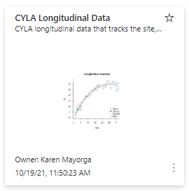
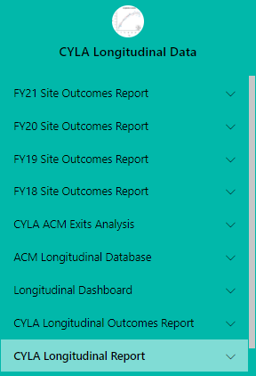
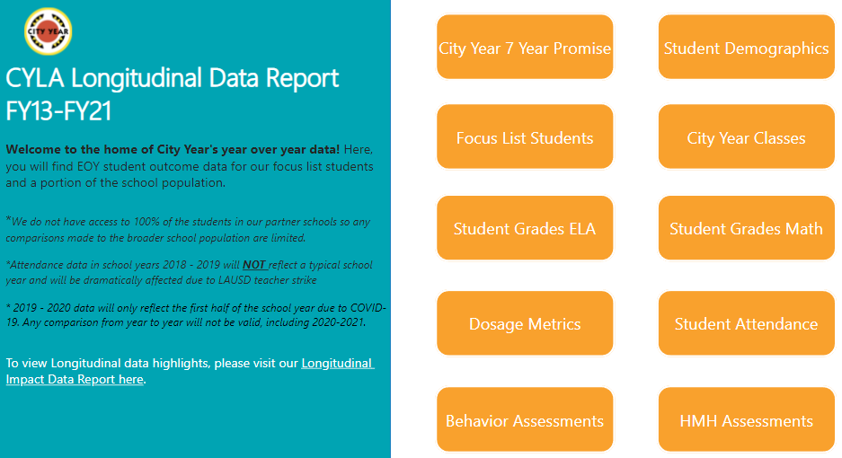

# CYLA Longitudinal Data Report FY13-FY21

This Power BI report contains City Year's data year over year. You will find the EOY (End of Year) student outcome data for our focus list students and a portion of the school population. Our data access is different year over year which effects the data we recieve for non-focus list students.

*A couple of things to note before going through the data is that:* 

- *Attendance data from 2018-2019 & 2019-2021 will **not** reflect a typical school yearand will be dramatically affected due to LAUSD teacher strike and COVID-19 pandemic.*
- *Data from the 2019 - 2020 school year will only reflect the first half of the school year due to COVID-19 pandemic. Any comparison from year to year will not be valid.*
- *Data from 2020-2021 school year will no be valid for year to year comparison due to virtual schooling due to COVID-19 pandemic.*

## Accessing the Longitudinal Data Power BI Report

1. Go to [app.powerbi.com/home](app.powerbi.com/home)
2. Click on the Apps icon on the left-hand navigation
3. Find and click on the *CYLA Longitudinal Data App*

4. Use the blue navigation menu to find and click on *CYLA Longitudinal Report*

5. Welcome to the Home page!

## How to Navigate the Report

- **City Year 7 Year Promise:** # of years students have been on a focus list
- **Student Demographics:** ethnicity, gender, and student's ELL Levels by filter list
- **Focus List Students:** breakdown of focus list numbers by course performance and SED lists
- **City Year Classes:** # of students in CY classes and # of teachers served
- **Student Grades (ELA & Math):** # and % of students that fall into improved, maintained, declined, or prevention category
- **Dosage Metrics:** tier 2 support time hours by filter list
- **Student Attendance:** improved attendance #'s and % by filter list
- **Behavior Assessments:** improved DESSA score #'s and % by filter list
- **HMH Assessments:** HMH improved and growth numbers and % by filter list

## Using Filter List Options
Due to changes by in City Year's data agreement with LAUSD, the IA team has started using an aggregation method to display longitudinal data. This means that each filter is an aggregation filter. Below you will find a list of the aggreggation levels that are availabe.

>- ELL Levels
>- ELL Levels_CP FL
>- ELT Status
>- Ethnicity
>- Ethnicity_CP FL
>- Focus List_CP FL
>- Focus List_SED
>- Gender
>- Gender_CP FL
>- Grade
>- Grad Level
>- Grade Level_CP FL
>- Grade_CP_FL
>- School Level
>- School Level_CP FL
>- School Level_Ethnicity
>- Site