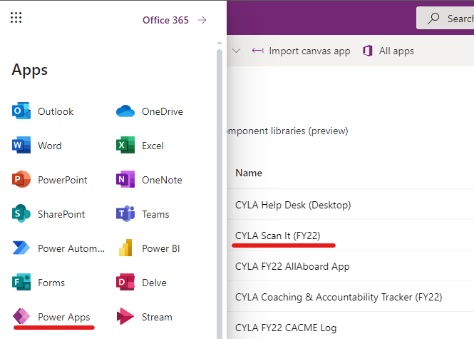

# PowerApps for Internal Use

Microsoft PowerApps is part of your office 365 suite of applications available to all staff and corps members at City Year. Just like you would log in with a browser to go to [CYconnect](https://cityyear.sharepoint.com/SitePages/Home.aspx) or [Outlook](https://outlook.office.com/mail/inbox) you can also access custom applications and forms created by local staff in "PowerApps". You can think of PowerApps as applications within applications **(App Inception)**. It provides a quick and easy way for City Year to deploy forms, apps and other tools quickly without the need to install anything new outside of the first PowerApps setup.

You can use PowerApps on [Desktop](https://make.powerapps.com/), [IOS](https://apps.apple.com/us/app/power-apps/id1047318566) and [Andriod](https://play.google.com/store/apps/details?id=com.microsoft.msapps&hl=en_US&gl=US) by logging into PowerApps with your City Year credentials (Same login as your email address). From here you will have access to any applications provided to you by City Year staff.

<body><h3 style="background-color:purple;"><c style=color:white; >*Available PowerApps</h3></body>

## PowerApps for Staff

[CACME Log](https://apps.powerapps.com/play/177e2b1e-389e-4c53-ab89-6e45eb360827?tenantId=a5c7899f-d129-48f6-ac88-8f97f366da74) 
* for Incoming ACM engagement between ACMs and managers.

[CYLA Accountability Tracker](https://apps.powerapps.com/play/815f8342-e375-4d4e-b033-bf500464c234?tenantId=a5c7899f-d129-48f6-ac88-8f97f366da74) 
* for recording coaching conversations

[CYLA Scan It](https://apps.powerapps.com/play/66197cdf-c395-466e-959f-8de857536aff?tenantId=a5c7899f-d129-48f6-ac88-8f97f366da74) 

* For recording ACM training session attendance for AmeriCorps compliance

* Look here for a [how to video](https://web.microsoftstream.com/video/636dce45-f1ea-48dc-8ef9-29f7e014ee06)

[CYLA Help Desk](https://apps.powerapps.com/play/e59acea6-d9ca-4183-b9fb-66d9844f2b01?tenantId=a5c7899f-d129-48f6-ac88-8f97f366da74)

* For communicating questions, support, troubleshooting and ideas to CYLA staff/departments.

*More apps coming soon

## Aps for ACMs

[CYLA Help Desk](https://apps.powerapps.com/play/e59acea6-d9ca-4183-b9fb-66d9844f2b01?tenantId=a5c7899f-d129-48f6-ac88-8f97f366da74)

* For communicating questions, support, troubleshooting and ideas to CYLA staff/departments.

[CYLA Scan It](https://apps.powerapps.com/play/66197cdf-c395-466e-959f-8de857536aff?tenantId=a5c7899f-d129-48f6-ac88-8f97f366da74)

* For recording ACM training session attendance for AmeriCorps compliance

* Look here for a [how to video](https://web.microsoftstream.com/video/636dce45-f1ea-48dc-8ef9-29f7e014ee06)

More coming soon*

*Note that you will only see PowerApps that have been assigned to you. Contact the impact analytics team if you suspect an app is missing (Cbischel@cityyear.org).

## PowerApps Setup

<body><h3 style="background-color:purple;"><c style=color:white;">Install Steps</h3></body>

To get started with PowerApps you first want to decide what devices you would like to use. Of course you can use your browser by navigating to https://make.powerapps.com/ and logging in with your City Year credentials but you can also install the PowerApp for IOS [here](https://apps.apple.com/us/app/power-apps/id1047318566) or Android [here](https://play.google.com/store/apps/details?id=com.microsoft.msapps&hl=en_US&gl=US) and use PowerApps on your mobile devices. 

While PowerApps works best on mobile you can use a desktop browser for most apps with no issues as well. The Impact Analytics team will send periodic communicaitons with links directly to said applications for use in the browser but you can also go to your available applications [here](https://make.powerapps.com/) by logging in with your City Year credentials. See below for a how to video for getting started with PowerApps on mobile devices.

<body><h3 style="background-color:purple;"><c style=color:white;">How to Video</h3></body>

If you are looking to use PowerApps on your IOS, Android or Desktop device see the video below for setup details. If you are using PowerApps via a browser you can simply click on the links above to navigate directly to the app you need to use.

<iframe width="640" height="360" src="https://web.microsoftstream.com/embed/video/33b90d18-0c2b-4bbc-a31c-654c846cf421?autoplay=false&showinfo=true" allowfullscreen style="border:none;"></iframe>

If you have ideas for new desktop and mobile apps, feedback about a current app or you need support with PowerApps please conact Chris Bischel (Cbischel@cityyear.org) or use the [CYLA Help Desk](https://cityyear.sharepoint.com/teams/lax/SitePages/CYLA%20Help%20Desk.aspx).