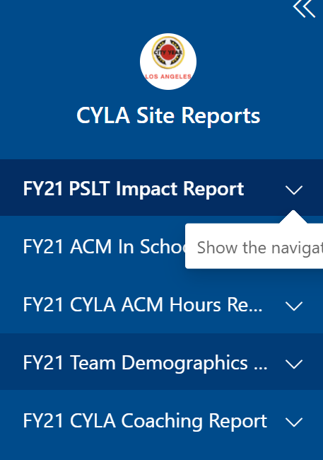
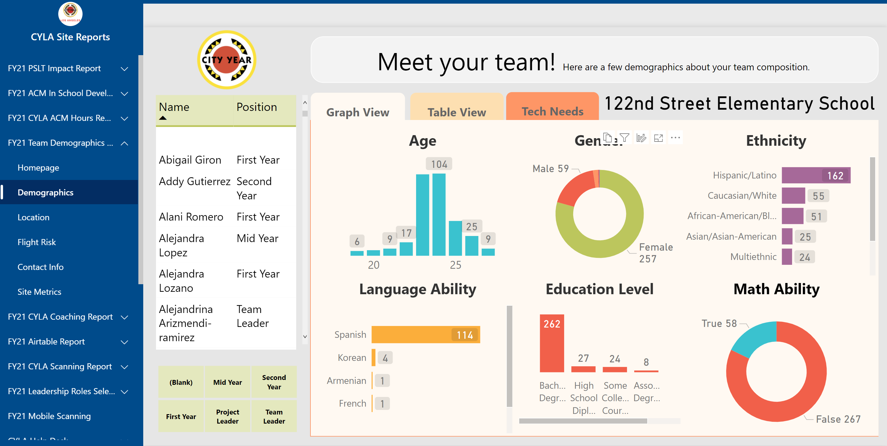

# Quarter # 1 (Start of Year)

<body><h3 style="background-color:darkturquoise;"><c style=color:white;">July - August</h3></body>

### Manager Checklist

>- [ ] Engage incoming ACMs on your team via the CACME PowerApp
>      - Directions [here](cacme.md)
>- [ ] Work with Analytics to ensure *teacher* data is available
>      - More information in section below
>      - Run school level teacher classes reports (LAUSD)
>      - Work with school partners to confirm Data Use Agreement signed (IUSD) 
>- [ ] Complete a draft version of ACM in Class Deployment
>      - This is a placeholder for the real In Class Deployment tool that helps the Analytics team securely scope data to just those who need to see it.
>           - Download [Draft Elementary ACM Deployment](https://bit.ly/3vyxqcv) 
>           - Download [Draft Secondary ACM Deployment](https://bit.ly/3vyxqcv)
>- [ ] Support corps members observing students in their classes
>      - Observations will ultimately support student interventions and selection of the focus list
>      - Use the resources listed below to assits ACMs in selecting focus list students
>           - What Makes a Good Focus List Checklist
>           - Power BI [FY22 WSWC Dashboard](https://bit.ly/3i2TCaW): Initial Indicators Page

## Getting Teacher Data

Data is key to much of what the Analytics team does each year but as a contractor for the district we can only get a limited scope of data and it must be stored securely. For both of our school districts the process of getting student data is different. See your school district below for more specifics on how to get school specific data for ACM deployment, focus lists and ELT.

### Los Angeles Unified School District

In June CYLA should communicate to LAUSD Office of Data and Accountability about re-establishing a data use contract for the coming school year. *This process has been historically slow and should be started as soon as possible*

1. Program Directors (PDs) and or Program Managers (Pms) should assist in this process by asking their partners to run a teacher schedule report. Teacher schedule reports should be uploaded here and then an email should be sent to the IA team. ()
   - Download directions for pulling teacher schedule report for your partner teachers here.

2. Pms should fill out a draft depoyment workbook to assign ACMs to class lines as they wait for teacher schedule reports from their school. Directions on how to get and use a draft deployment workbook can be foud in the section below.
   - Use Team Demographics Dashboard to help you place ACMs into class lines 

### Inglewood Unified School District

Inglewood uses a data platform called Schoolzilla to manage their data. City Year uses Schoolzilla to access student performance data for your schools. Sometime in the first quarter the Analytics team will provide a training specifically for IUSD schools on how to access Schoolzilla for viewing student performance data.

1. Pms should fill out a draft depoyment workbook to assign ACMs to class lines. Directions on how to get and use a draft deployment workbook can be foud in the section below.
   - Use Team Demographics Dashboard to help you place ACMs into class lines

## Draft Deployment Workbook

In the summer, as you plan with partners where ACMs will be placed into class lines, please fill out a copy of the draft deployment workbook. The IA team has build out the Team Demographics Dashboard to assist with this process by providing information that might help with assigning class lines. See the section below for more info on the dashboard.

This workbook will be a placeholder for the Final Deployment Workbook that will be released when you have submitted a teacher schedule report. The final workbook will then become a key part of our data model and will be used to get access to student data from those specified class lines. Without a draft or final deployment, our team will not be able to access data for students in ACM classes, please complete by: (XX/XX/XXXX).

>- Download [Draft Elementary ACM Deployment](https://bit.ly/3vyxqcv) 
>- Download [Draft Secondary ACM Deployment](https://bit.ly/3vyxqcv)

### Team Demographics Dashboard

1. Visit app.powerbi.com
2. Go to Apps using the left-hand navigation
3. Find the CYLA Site Reports App
4. Use the left-hand navigation to find the "FY22 Team Demographics" dsahboard

## Support ACMs w/FL

In FY22 the focus list process is being simplified to have less steps and allow for greater flexibility in selecting students. Rather than starting with an initial caseload of students and then narrowing it down to a final focus list Corps members will just pick a caseload of 11 students when they feel like they have identified the correct students to receive services. The timeline for this process is listed below along with a list of considerations ACMs can use to help them make their final decsions.

| Item                                          | Suggest Due Date | Links to Docs |
|-----------------------------------------------|------------------|---------------|
| School Start Date                             |                  |               |
| ACMs begin observing students                 | 8/15/2021        |               |
| ACMs use FL Checklist                         | 8/15/2021        | Document      |
| ACMs use Power BI EWI Pages                   | 8/25/2021        | Link to PBI   |
| Focus List Workbook Training                  | 9/1/2021         |               |
| ACM Select 11 FFLS                            | 10/15/2021       |               |
| ACM Select 6 SED Students                     | 10/20/2021       |               |
| PMs notify IA when all ACMs have finalized FL | 10/30/2021       |               |

### What Makes a Good Focus List?

*To view full document, follow this link*

- [ ] In the past year, was this student on track or off track?
  - 96% or higher attendance
  - Passing ELA and Math classes
  - No more than 1 behavior mark the prior year
- [ ] Does the student have low attendance last year or within the first ten weeks of this year?
  - Missing more than two days of the first month of school
- [ ] Is the student missing assignments or scoring low on in class content in the first month?