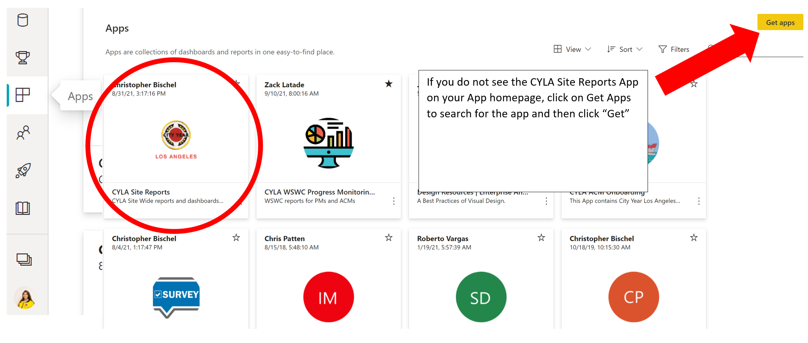

# Quarter #1 (Summer Planning)

<body><h3 style="background-color:dodgerblue;"><c style="color:white"> July - August Items <c/></h3></body>

The first quarter of the year starts in July before the corps has arrived for BTA. Analytics is at work getting teams prepared for service by running team placement, CACME engagement for incoming corps and general end of year closeout items. The first quarter involves a great deal of planning before we enter the school house around things like goal setting with partners, engaging with incoming ACMs, and planning out where your team will be placed in schools with teachers. See below a checklist of first quarter items, specific dates and directions for each task. 

### <span style="color:darkturquoise;"> <i> First Quarter Checklist </i></span>

>- [ ] Engage incoming ACMs on your team via the [CACME PowerApp](#engage-in-cacme-tracking) by leveraging your [team demographics dashboards](#Accessing-Team-Demographics-Dashboard) or [the AllAboard Report](https://bit.ly/3hgfRsD)
>- [ ] **LAUSD ONLY** Work with school partners to provide a [Teacher Schedule Report](#getting-teacher-roster-reports) in CSV format to Analytics and upload to [this folder](https://bit.ly/3ts6xXr)
>- [ ] Complete a draft version of [ACM in Class Deployment Workbook](#draft-deployment-workbook) by leveraging your [team demographics dashboards](https://bit.ly/2US97cg) as needed
>- [ ] Check in with your TL to review [ELT data processes](#extended-learning-time)

<body><h3 style="background-color:dodgerblue;"><c style="color:white"> July - August Item Details </h3></body>

## Engage in CACME Tracking

   Analytics summer planning starts with engaging corps members who have been placed at your schools. The ACM onboarding team has worked all summer with Recruitment and Admissions to get your ACMs prepared for service and ready to show up to BTA. To view your teams and their unique dempographics, go to the [FY23 Team Demographics Power BI Report](https://app.powerbi.com/links/lMotOoY8K-?ctid=a5c7899f-d129-48f6-ac88-8f97f366da74&pbi_source=linkShare). For step-by-step directions on accesing the report, view the directions below this video.

<div style='max-width: 640px'><div style='position: relative; padding-bottom: 56.25%; height: 0; overflow: hidden;'><iframe width="640" height="360" src="https://web.microsoftstream.com/embed/video/b5ef8562-7ff8-4f3e-bb69-667c896b2fc2?autoplay=false&showinfo=true" allowfullscreen style="border:none;"></iframe></div></div>

### Accessing Team Demographics Dashboard

1. Visit [app.powerbi.com](https://app.powerbi.com/) OR find the yellow Power BI icon in the app launcher found on the top left-hand corner of your outlook email or on any page on cyconnect


2. Go to Apps using the left-hand navigation
3. Find the CYLA Site Reports App

<p align="center">

</p>

4. Use the left-hand navigation to find the "FY23 Team Demographics" dashboard

<p align="center">

</p>

## Getting Teacher Roster Reports

   Data is key to much of what the Analytics team does each year but as a contractor for the district we can only get a limited scope of data and it must be stored securely. For both of our school districts the process of getting student data is different. See your school district below for more specifics on how to get school specific data for ACM deployment, focus lists and ELT.

### <u> Los Angeles Unified School District </u>
   In June CYLA should communicate to LAUSD Office of Data and Accountability about re-establishing a data use contract for the coming school year. *This process has been historically slow and should be started as soon as possible*

   1. Program Directors (PDs) and or Program Managers (PMs) should assist in this process by asking their partners to run a teacher schedule report. Teacher schedule reports should be uploaded to this [folder](https://cityyear.sharepoint.com/:f:/r/sites/LAX-Staff2/Shared%20Documents/ProServe/FY23/FY23%20Teacher%20Roster%20Reports?csf=1&web=1&e=aXbodJ)
   2. PDs should update the tracker.

      ```pdf
      files/Teacher_Roster_Report_Protocol.pdf
      ```

## Draft Deployment Workbook

In the summer, as you plan with partners where ACMs will be placed into class lines, please fill out a copy of the draft deployment workbook. The IA team has build out the [Team Demographics Dashboard](https://app.powerbi.com/groups/me/apps/ef5c272b-d1fa-43af-9087-89a6e1bfc5f4/reports/bf4570e7-f74d-428f-aa79-0137f7218fd6/ReportSection) to assist with this process by providing information that might help with assigning class lines.**This workbook will be a placeholder for the Final Deployment Workbook** that will be *released when you have submitted a teacher schedule report.* Workbooks for elementary and secondary schools will differ due to their specific needs. Span schools will have both an elementary and secondary version to meet the needs of the grades they will be serving.

The final workbook will then become a key part of our data model and will be used to get access to student data from those specified class lines. Without a completed draft or final deployment workbook, our team will not be able to access data for students, **please complete as soon as possible.**

>- **Before submitting Teacher Roster Report:** Access your team's [Draft Deployment Workbook](https://bit.ly/3he0KjI)
>- **After submitting Teacher Roster Report:** Access your team's [Final Deployment](https://bit.ly/3C8dd0n) 
```pdf
   files/Elem_Deployment_Workbook.pdf
```

```pdf
   files/Sec_Deployment_Workbook.pdf
```

## Extended Learning Time

The general MOCHA for ELT data items is shown below. For more information about ELT technical processes and training refer to the [ELT roadmap page](https://cylalighthouse.github.io/IA_Road_Map/#/elt).


|     Item                                            |     Program Manager    |     Team Leader    |     Corps Member    |
|-----------------------------------------------------|------------------------|--------------------|---------------------|
|     Conducts ELT programming                        |     Manager            |     Owner          |     Helper          |
|     Deploys and Collects ELT Applications           |                        |     Owner          |     Helper          |
|     Digitizes ELT Applications in Workbooks         |                        |     Owner          |     Helper          |
|     Fills out ELT Rosters on Workbooks              |                        |     Owner          |     Consulted       |
|     Prints ELT Rosters and/or Enters Time In/Out    |                        |     Owner          |     Helper          |
|     Reviews ELT Data regularly                      |     Manager            |     Owner          |     Helper          |
|     Validates data errors                           |     Manager            |     Owner          |     Consulted       |
|     Ensures a high quality ELT program              |     Manager            |     Owner          |     Helper          |
