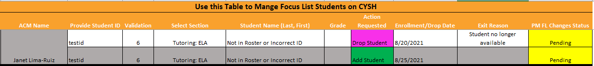
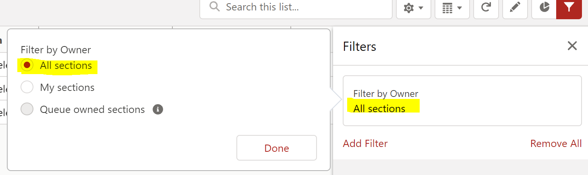
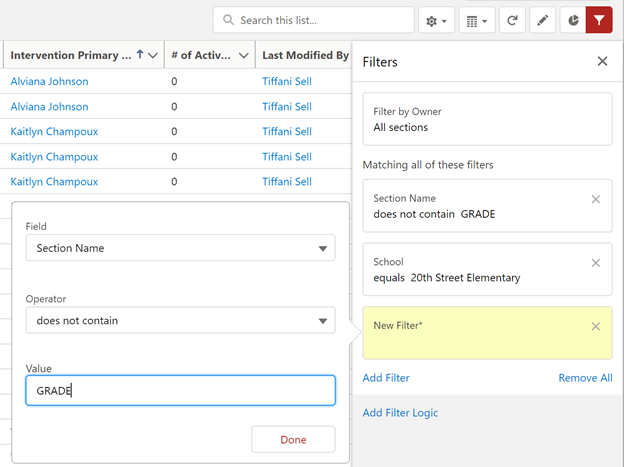
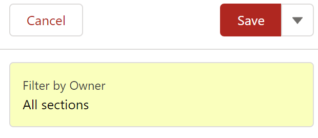
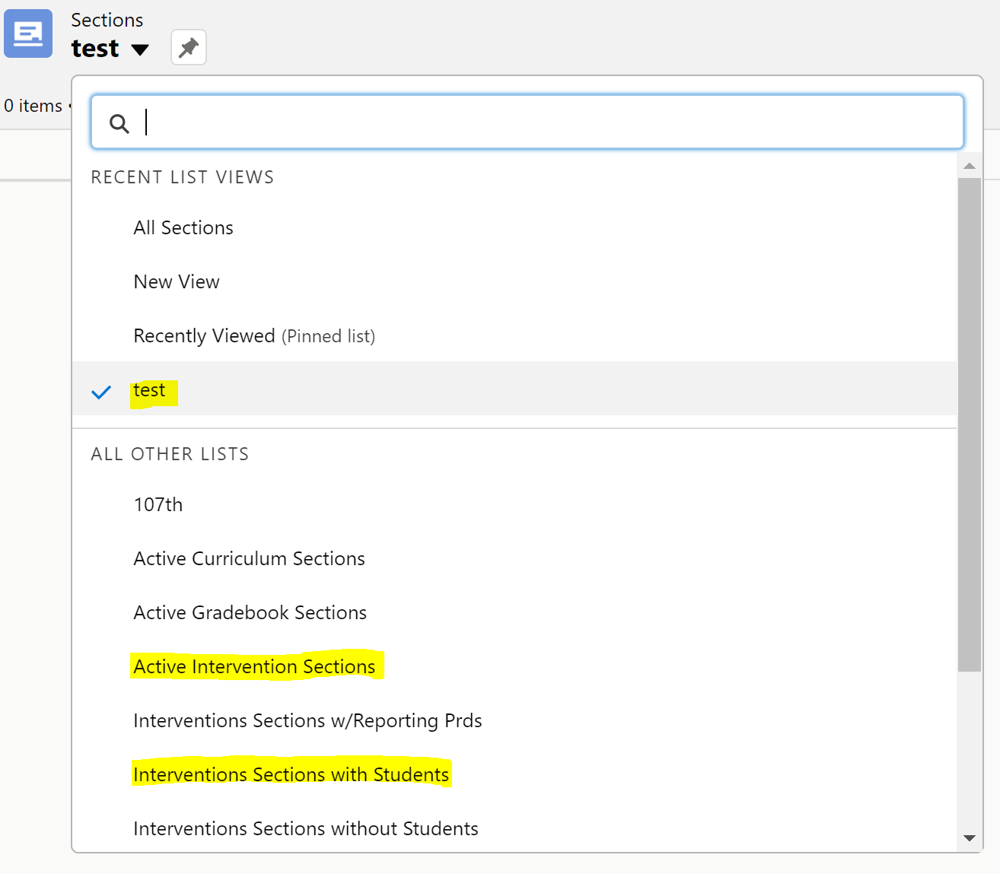
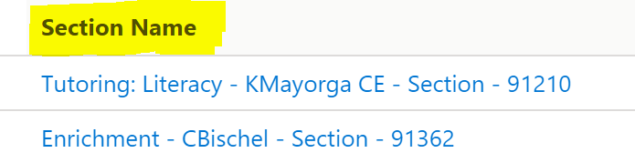
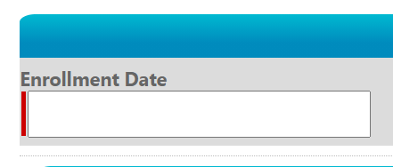
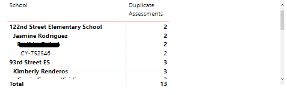
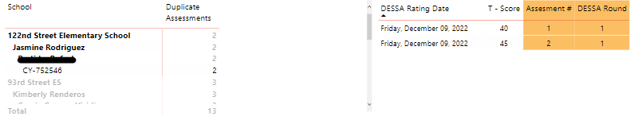

# Quarter #3 (Mid-Year Return)

<body><h3 style="background-color:dodgerblue;"><c style="color:white;">January - March</h3></body>

<body><h3><i> 
Third Quarter Checklist
</i></h3></body>

>- [ ] Review [CYSH Lightning Training](#review-cysh-lightning-training)
>- [ ] Validate [Focus Lists Sections on CYSH](#validate-focus-list-sections-on-cysh)
>- [ ] Manage [Focus List Changes in CYSH](#manage-focus-list-changes-in-CYSH)
>- [ ] Attend [Indicator Areas Training with Impact Analytics](#Indicator-Areas-Training-with-Impact-Analytics)
>- [ ] [Update Indicator Areas](#update-indicator-areas) for all CYSH sections
>- [ ] [Prepare for DESSA Administration Rd 2](#prepare-for-dessa-administration-rd-2)
>- [ ] [Prepare for HMH Administration Rd 2](#prepare-for-hmh-administration-rd-2) **optional**
>- [ ] [Clean-up DESSA Duplicate ratings](#clean-up-dessa-duplicate-ratings)
>- [ ] Clean-up [T2ST Time](#clean-up-t2st-time)
>- [ ] Partner [Survey Tasks](#partner-survey-tasks)

<body><h3 style="background-color:dodgerblue;"><c style="color:white">January - March Item Details</h3></body>

## Review CYSH Lightning Training

- [CYSH Program Manager Training](https://cityyear.sharepoint.com/sites/LAX-Staff2/Shared%20Documents/ProServe/FY23/Learning%20and%20Development/Time%20Tracking%20Bundle/CYSH/CYSH%20Mangement_PMs.pptx?web=1)

## Validate Focus List Sections on CYSH

1. Do all ACMs have a full caseload? [Power BI PSLT Workbook](https://app.powerbi.com/groups/me/apps/ef5c272b-d1fa-43af-9087-89a6e1bfc5f4/reports/c4be0a62-cb5d-4b0f-b368-55c0e04050ae/ReportSection23ee6aa2b060d0c0a389?ctid=a5c7899f-d129-48f6-ac88-8f97f366da74&bookmarkGuid=Bookmarkb2a3738a9f701600ef4b)
2. Do all ACMs have a full SED caseload? [Power BI PSLT Workbook](https://app.powerbi.com/groups/me/apps/ef5c272b-d1fa-43af-9087-89a6e1bfc5f4/reports/c4be0a62-cb5d-4b0f-b368-55c0e04050ae/ReportSection23ee6aa2b060d0c0a389?ctid=a5c7899f-d129-48f6-ac88-8f97f366da74&bookmarkGuid=Bookmark2b8d931bece57598d3cb)
3. Do any ACMs need to add a new or missing focus list student?
4. Do any ACMs need to remove a focus list student?

## Manage Focus List Changes in CYSH

In pervious years the Impact Analytics team processed all focus list changes through a form on cyconnect. This meant that changes could take 1-2 business days to process. In FY19, a group of program managers piloted managing their own focus lists on CYSH. The results were positive and in FY20 +, program managers are trained to use CYSH to manage their own caseloads. Program Managers are welcome to use any FERPA compliant tool to help keep track of changes that need to be made to ACMs caseloads and the IA team has also provided a template via the focus list workbooks. Below are resources for using CYSH.

>- Each Focus List Workbook has an **FL Changes** Tab
>- ACMS can use columns 3-11 to identify the student(s), the change they need, the section they are located in, and the drop or enrollment date
>- PMs can use column 12 to keep track of their actions: pending, approved, complete, denied

### Customize Section View Page on CYSH

Managing your ACM's sections will be easier if you are able to customize how you view your sections. It is simple and takes about two minutes!

1. Open CYSH by clicking on the cyschoolhouse tile on your [Okta Homepage](https://cityyear.okta.com/app/UserHome)
2. Click the **Sections** button on the ribbon on the homepage

3. Click on the gear icon to select **New**

4. Name the view and select **Only I can see this list view**, then click save

5. Click on the gear icon again and click on **Select Fields to Dsiplay**

6. Select Fields by clicking on them and hitting the right arrow button. Sort fields as desired the click Done. Recommended Fields and Order: (School, Section Name, Program, Intervention Primary Staff, # of Active Students, Last Modified By)

7. Finally, update the right-hand filter pane by selecting the **Filter By Owner** filter option and changing the setting to *All Sections*. Then add a new filter to remove gradebook sections from your view.

	

	
> - Click **Add Filter**
> - **FIELD:** Section Name
> - **Operator:**  Does Not Contain
> - **Value:** GRADE
> - Click Save

### Removing Students from CYSH Section

1. Open CYSH by clicking on the cyschoolhouse tile on your [Okta Homepage](https://cityyear.okta.com/app/UserHome)
2. Click on **Sections** option in the ribbon the the homepage

	

3. Select your view at the top-right and search for the desired section and click on the link under the **Section Name** column

	

	

4. Click on **Section Intervention Data** at the top-left hand corner

	

5. Select the student by clicking on the box next to their name then click on **Withdraw** students

	

6. Select an **exit date** and **exit reason** then click save

**Exit date should be the last day that the ACM provided services**

### Adding Students to CYSH Section

1. Open CYSH by clicking on the cyschoolhouse tile on your [Okta Homepage](https://cityyear.okta.com/app/UserHome)
2. Click on **Sections** option in the ribbon the the homepage

	

3. Select your view at the top-right and search for the desired section and click on the link under the **Section Name** column

	

	

4. Click on **Section Intervention Data** at the top-left hand corner

	

5. Click on **Enroll Student(s)**

	

6. Enter the Enrollment Date: **date should be the first day ACM started providing services to student**

*If enrolling mutiple students and they have different enrollment dates, you will have to repeat the process for each enrollment date.*

7. Select the student(s) by clicking on them in the left-hand pane and then clicking the right-arrow button to move them to the right-hand pane. **Tip:** Use the grade and letter filter to filter student list to the grade they student is enrolled in and to the letter of their first name

8. Click Save

## Indicator Areas Training with Impact Analytics

- date for the training
- Link to the PPT training

## Update Indicator areas

PMs must go through this process for each ACM section including: ELA/Math/SEL Check In Check Out
PMs should add indicator areas as soon as final focus lists are validated for each ACM section.

1. Open CYSH by clicking on the cyschoolhouse tile on your [Okta Homepage](https://cityyear.okta.com/app/UserHome)
2. Click on **Sections** option in the ribbon the the homepage

	

3. Select your view at the top-right and search for the desired section and click on the link under the **Section Name** column

	

	

4. Click on **Section Intervention Data** at the top-left hand corner

	

5. Select all students

	

6. Click on **Add To Inidcator Area**
	
	

7. Update the IA Effective Date. **Note:** this date should be the first day the student started recieving services. If students have different IA dates, you will have to select groups of students and add indicators seperately.

	

8. Click Save

## Clean-up DESSA Duplicate ratings

- Before we start the next DESSA Round we need to clean up the data in Aperture. View [this dashboard](https://app.powerbi.com/groups/me/apps/e9ba0db1-f81b-4997-96e7-19bef83819f1/reports/448648d3-78e2-4ab5-a1ad-3a0fa9ed9aad/ReportSection7b448b78ec0ca03c0933?ctid=a5c7899f-d129-48f6-ac88-8f97f366da74) to see if your team has any duplicate assessments from the Previous Assessment.

- Once we opened the WSWC Dashboard we will use the second half of the dashboard. It is under the title **"Please Fix Duplicate DESSA Submissions"**

- This first table will show what ACM's have duplicate assessments and what students have more than 1 assessment during a DESSA Window.

- Once we have identified what student(s) have duplicate assessments, you can click on the student's name in the table and the table next to it will filter to the multiple assessments and the dates they were administered.

- To support with cleaning the data you will need to submit a [help desk](https://cityyear.sharepoint.com/teams/lax/Lists/Test/Issue/newifs.aspx?List=53a03e3a-0288-41d4-b12c-bcdd86af087f&Source=https%3a//cityyear.sharepoint.com/teams/lax/Pages/My-CYLA-Help-Desk-Cases.aspx&RootFolder=&Web=23636188-2f45-4295-809c-a8ec947729e4) or send a teams message to the IA team. ***Please remember to not send Student information via email. The Help Desk and Teams are the FERPA Compliant ways to send student information.***
- The information that the IA team will need to support in deleting a duplicate assessment is: The Student Name, the DESSA Rating Date, the student's CYID and the T-Score. Send this information to the IA team and they will support in deleting the duplicate assessment.

## Prepare for DESSA Administration Rd 2

- DESSA Round 2 Observations Week 1 Starts 2/6/2023
- DESSA Round 2 Observations Week 2 Starts 2/13/2023
- DESSA Round 2 Observations Week 3 Starts 2/20/2023
- DESSA Round 2 Observations Week 4 Starts 2/27/2023

- DESSA Round 2 Administration 3/6/2023 - 3/10/2023

## Prepare for HMH Administration Rd 2

- Please reach out to IA about dates. And they will support you in HMH Administration. 

## Clean-up T2ST Time

- Show step-by-step instructions and screenshots on how to use PBI report to see time that needs to be corrected
- PDF of step-by-step instructions of how ACMs can edit previously entered time

## Partner Survey Tasks

- TBD (ask CB)