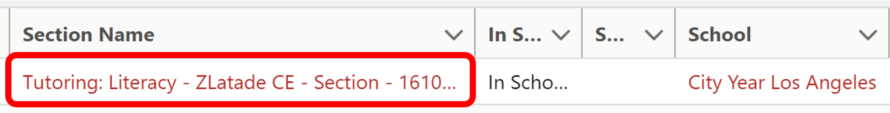
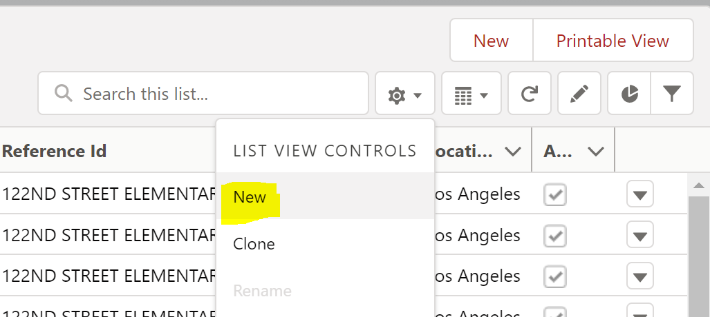
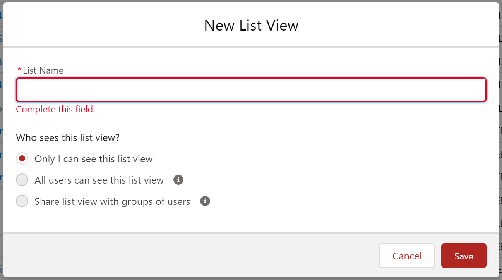
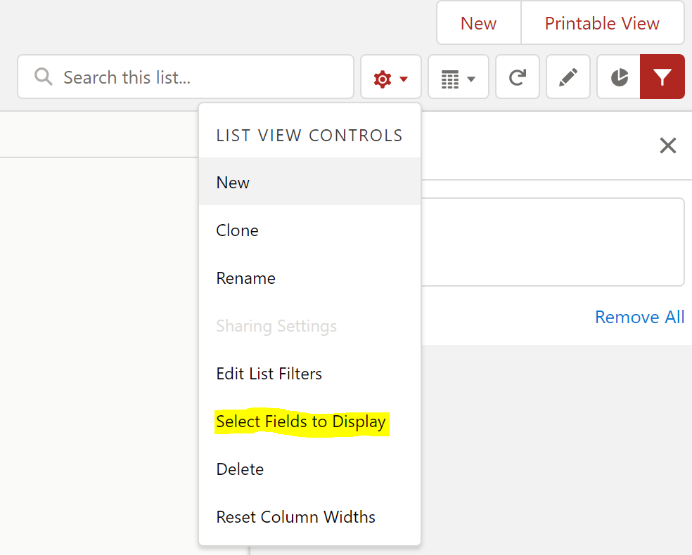
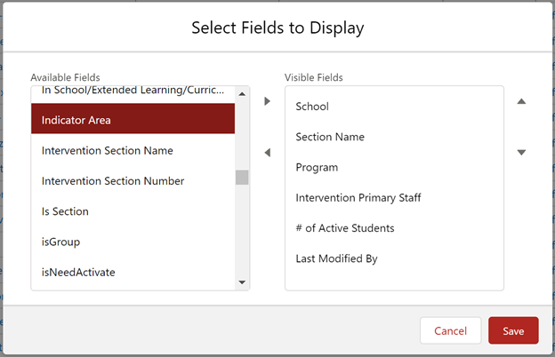

# Quarter #3 (Mid-Year Return)

<body><h3 style="background-color:dodgerblue;"><c style="color:white;">January - March</h3></body>

<body><h3><i> 
Third Quarter Checklist
</i></h3></body>

>- [ ] Review [CYSH Lightning Training](#review-cysh-lightning-training)
>- [ ] Validate [Focus Lists Sections on CYSH](#validate-focus-list-sections-on-cysh)
>- [ ] Manage [Focus List Changes in CYSH](#manage-focus-list-changes-in-CYSH)
>- [ ] Attend [Indicator Areas Training with Impact Analytics](#Indicator-Areas-Training-with-Impact-Analytics)
>- [ ] [Update Indicator Areas](#update-indicator-areas) for all CYSH sections
>- [ ] [Prepare for DESSA Administration Rd 2](#prepare-for-dessa-administration-rd-2)
>- [ ] [Prepare for HMH Administration Rd 2](#prepare-for-hmh-administration-rd-2) **optional**
>- [ ] [Clean-up DESSA Duplicate ratings](#clean-up-dessa-duplicate-ratings)
>- [ ] Clean-up [T2ST Time](#clean-up-t2st-time)
>- [ ] Partner [Survey Tasks](#partner-survey-tasks)

<body><h3 style="background-color:dodgerblue;"><c style="color:white">January - March Item Details</h3></body>

## Review CYSH Lightning Training

- Add link for the PPT training

## Validate Focus List Sections on CYSH

1. Do all ACMs have a full caseload? (Power BI PSLT Workbook)
2. Do all ACMs have a full SED caseload? (Power BI PSLT Workbook)
3. Do any ACMs need to add a new or missing focus list student?
4. Do any ACMs need to remove a focus list student?

## Manage Focus List Changes in CYSH

In pervious years the Impact Analytics team processed all focus list changes through a form on cyconnect. This meant that changes could take 1-2 business days to process. In FY19, a group of program managers piloted managing their own focus lists on CYSH. The results were positive and in FY20 +, program managers are trained to use CYSH to do their own caseload management. Program Managers are welcome to use any FERPA compliant tool to help keep track of changes that need to be made to ACMs caseloads and the IA team has also provided a template via the focus list workbooks. Below are resources for using CYSH.

- *PDF of FL Management Tab in FL workbook*

### Customize Section View Page on CYSH

1. Open CYSH by clicking on the cyschoolhouse tile on your Okta Homepage
2. Click on **Sections** option in the ribbon the the homepage

3. Click on the gear icon to select **New**

4. Name the view and select settings, then click save

5. Click on the hear icon to select **Select Fields to Dsiplay**

6. Select Fields by clicking on them and hitting the right arrow button. Sort fields as desired the click save

### Removing Students from CYSH Section

1. Open CYSH by clicking on the cyschoolhouse tile on your Okta Homepage
2. Click on **Sections** option in the ribbon the the homepage

3. Select your view at the top-right and search for the desired section and click on the link under the **Section Name** column

### Adding Students to CYSH Section

## Indicator Areas Training with Impact Analytics

- date for the training
- Link to the PPT training

## Update Indicator areas

- PDF of step-by-step guide for how to update indicator areas

## Prepare for DESSA Administration Rd 2

- TBD

## Prepare for HMH Administration Rd 2

- TBD 

## Clean-up DESSA Duplicate ratings

- Show step-by-step instructions and screenshots on how to use PBI report to see duplicate ratings
- PMs should check in with ACMs to decide which rating to keep
- Pms should contact IA and provide student CY-ID, date of rating and T-Score of rating

## Clean-up T2ST Time

- Show step-by-step instructions and screenshots on how to use PBI report to see time that needs to be corrected
- PDF of step-by-step instructions of how ACMs can edit previously entered time

## Partner Survey Tasks

- TBD (ask CB)