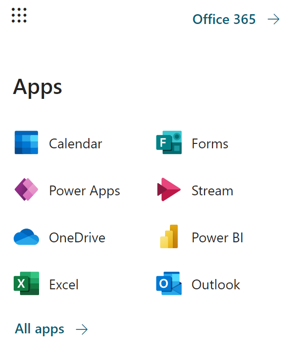
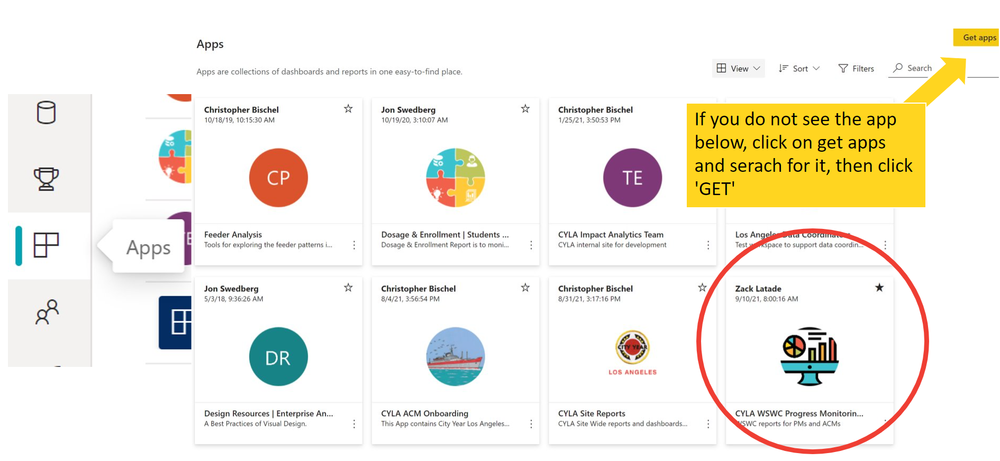

# <span style="color:darkslateblue"> text </span>
## <span style="color:darkorange"> text </span>
### <span style="color:darkturquoise"> text </span>


<span style="color:blue"> # text: fail </span>


Does this link take you to the [test this link](#custom-id)

how about [this](#heading-test)

# Quarter #2 (Starting Strong)

<body><h3><i> <p style="color:darkturquoise">Second Quarter Checklist</p></i></h3></body>

>- [ ] Complete your Final Deployment Workbook. [Found on your school dashboard.](https://cityyear.sharepoint.com/teams/lax/LaxPrivate/LAProServe/SitePages/School%20Dashboards.aspx)
>- [ ] Support corps members in observing students in their classes
>     - What Makes a <a href="#supporting-acms">Good Focus List Checklist </a>
>     - Power BI [FY22 WSWC Dashboard](https://bit.ly/3i2TCaW): Initial Indicators Page
>- [ ] Ensure ACMs participate in <a href="#q1-acme-survey"> Q1 ACME Survey </a> from HQ
>     - You should have access to [CultureAmp](https://cityyear.cultureamp.com/app/home) to view results as they come in
>- [ ] IUSD ONLY: Activate your Mosaic account & Support ACMs to activate their accounts as well
>- [ ] IUSD ONLY: Train ACMs on Mosaic
>- [ ] Train your team on the [T2ST Time tracking processes](https://bit.ly/3C3RExY)
>- [ ] Support ACMs as they use [paper trackers](https://bit.ly/3lgzO3K)
>- [ ] Train ACMs on the Focus List Process & FL Process Training & FL Roll-Out Pt.1 + 2
>- [ ] Faciliate the [Focus List Workbook](https://bit.ly/3z8jrv2) training for your team
>- [ ] Support your team in finalizing their 11 focus list students in the [Focus List Workbook](https://cityyear.sharepoint.com/teams/lax/LaxPrivate/LAProServe/SitePages/School%20Dashboards.aspx) and audit as necessary
>- [ ] Attend Analytics Training on CYSchoolhouse Lightning
>- [ ] Prepare  for HMH Assessments  if applicable for your school **Optional**
>     - Without HMH your goals will be measured by grades at secondary and Marks at elementary
>- [ ] Roll-out DESSA Training to team **Optional**
>- [ ] Prepare for DESSA Assessments **Optional**
>     - Information about DESSA can be found [here](https://bit.ly/3AfjGpR)
>- [ ] Support your team in finalizing their 6 SED FL students in the [Focus List Workbook](https://cityyear.sharepoint.com/teams/lax/LaxPrivate/LAProServe/SitePages/School%20Dashboards.aspx) and audit as necessary
>- [ ] Continue on to [Quarter 2](q2.md) when ready.

<body><h3 style="background-color:darkslateblue;"><c style="color:white">September - December Item Details</h3></body>


<h3><p style="color:darkturquoise"><i> Final Deployment Workbooks </i></p></h3>

Filling out the **Final Deployment workbooks** is the last step PMs need to take in order to begin the process of recieving student level data for their schools. The information from these workbooks will allows the IA team to request student data that will made accessible to PMs and ACMs through the WSWC Power BI Report.

*In addition to providing IA with ACM class line information, please use your workbook to share partner teacher, admin and/or other staff emails for upcomming partner surveys.*

>- **Before submitting Teacher Roster Report:** Access your team's [Draft Deployment Workbook](https://bit.ly/3he0KjI)
>- **After submitting Teacher Roster Report:** Access your team's [Final Deployment](https://bit.ly/3C8dd0n)

```pdf
   files/Elem_Deployment_Workbook.pdf
```

```pdf
   files/Sec_Deployment_Workbook.pdf
```

<section id="supporting-acms">
<h3><p style="color:darkturquoise"><i> Support ACMs with Focus List Selections </i></p></h3>
</section>

<h4><p style="color:darkorange"> The Focus List Process </p></h4>

In FY22 the focus list process is being simplified to have less steps and allow for greater flexibility in selecting students. Rather than starting with an initial caseload of 15 students and then narrowing it down to a final focus list, Corps members will only pick a caseload of 11 students when they feel like they have identified the correct students to receive services. The timeline for this process is listed below along with <a href="#good-fl"> recommendations </a> for focus list fit.

The general timelines for the focus list process are below and are subject to change. Keep in mind these are recommended windows in which things should progress and your school may be different. 

|    |Item                                          | Suggest Due Date | Links to Docs |
|----|----------------------------------------------|----------------------|---------------|
|[x]| PMs deploy ACMs into classes| 8/13/2021 | [Draft Deployment Workbook](https://bit.ly/3he0KjI)|
|[x]| LAUSD School Start Date                       | 8/16/2021        |               |
|[x]| IUSD School Start Date                        | 8/23/2021        |               |
|[x]| ACMs begin Observing Students | 8/15/2021 | [Observation Catchers](https://bit.ly/3AfjGpR)|
|[ ]| Time Tracking Training           | 8/15/2021| [Time Tracking Academic Coaching](https://bit.ly/3Ecx2Fw)|
|[ ]| Focus List Training                           |                  |               |
|[ ]| LAUSD ACMs use Power BI: Initial Indicators Pages to access student data| 8/25/2021| [WSWC Progress Monitoring Report](https://bit.ly/3A9kvQN) |
|[ ]| IUSD ACMs use Mosaic to access student data | 9/x/2021| [Mosaic Trainings]() |
|[ ]| Focus List Workbook Training | 9/15/2021 | [Focus List Workbook Roll-Out](https://bit.ly/3k8LJBC) + [Focus List Wkbk Overview](https://bit.ly/3C8FJPf)|
|[ ]| ACM Select 11 FLS                             | 10/15/2021       |               |
|[ ]| ACMs DESSA their 11 FLs                       |                  |               |
|[ ]| ACM Select 6 SED Students                     | 10/20/2021       |               |
|[ ]| PMs notify IA when all ACMs have finalized FL List on Workbooks| 10/30/2021|     |

The Initial Focus List process begins with completing your school’s draft Deployment Workbook Template. Completion of the draft Deployment Workbook signifies that your team has been deployed into stable class lines and are ready to take steps towards building their initial focus list. Prior to making selections, ACMs will begin their student observation window (1-2 weeks). During this time, ACMs will begin to identify potential students, have initial conversations with their partner teachers, and explore the Initial indicators dashboard if data is availabe, otherswise ACMs can ask partner teachers for student data.

<section id="good-fl"><h4><p style="color:darkorange"> What to Look for in a Focus List </p></h4></section>

>- Partner Teacher Approval
>- Observations that student is **Off Track** & willing to be coached
>- Data indicates good fit:
>     - D or F in related subject (ELA/Math)
>     - 2 or 3 in Elementary Marks
>     - SED: Behavior infractions and/or 86-95% ADA previous year or currently

Please note that data indicators are not definitive criteria for selecting a focus list student. ACMs should also consider partner teacher input and their own observations. However, focus list students must be off track to join a caseload. If student data is not available on Power BI, ACMs should try to get this data from their partner teachers.

*View complete [FY22 Service Model document](https://bit.ly/3tESBtt)*

<h4><p style="color:darkorange"> Accessing Power BI </p></h4>

1. Visit app.powerbi OR find the yellow Power BI icon in the app launcher found int he top lef-hand corner of your outlook email or on any page on cyconnect



2. Go to Apps using the left-hand navigation
3. Find the CYLA WSWC Progress Monitoring Reports App



4. Use the left-hand navigation to find the "FY22 Progress Monitoring" dashboard

<u><h4> What you will find in the Initial Indicators page: </u></h4>

| Data You Will See                        | Data You *Might* See                     |
|------------------------------------------|------------------------------------------|
| General student demographics: Grade, ELL Status, ELD Level, SPED Indicator | Previous year course grades (ELA/Math)   |
| Current course grades from most recent marking period                      | # of Failed Courses in the previous year |
| Most recent attendance rate                                                | Previous Year attendance rate            |
| ACMs use Power BI EWI Pages                                                | ELA/Math SBAC bands from previous year   |


<h4><p style="color:darkorange"> Accessing Mosaic </p></h4>

ACMs serving in a IUSD school will have access to student data via a platform call Schoolzille Mosaic. Here ACMs will have access to course performance, assessment, and demographics data for the students in their classes. They should use Schoolzilla Mosaic to help them select focus list students. In order for them to do this, PMs must walk them through the following two trainings:

> 1. [Mosaic Account Set-Up Training](https://bit.ly/3lj8TUZ)
> 2. [Mosaic Focus List Training](https://bit.ly/3kecFQt)

*For any technical difficulties or questions, please reach out cbischel@cityyear.org*

<section id="acmesurvey">
<h3><p style="color:darkturquoise"><i> Q1 ACME Survey </p></i></h3>
</section>

The headquarters AmeriCorps Member Experience team runs a survey every quarter for corps members to give their input on key questions used by the organization to monitor the experience and engagement of the corps in their service year. 

Michelle will share more details about the dates/times for the survey but in the meantime you can reference this link to view past results for the ACME survey

**Include info for how to access [CultureAmp](https://cityyear.cultureamp.com/app/home) data**

<h3><p style="color:darkturquoise"><i> Focus List ACM Trainings </i></p></h3>

## heading test

To continue moving forward in the focus list process, PMs must have their teams go throught the following trainings:

| Training                      | Who?    | Dates   |
|-------------------------------|---------|---------|
| [T2ST Time Tracking Process](https://bit.ly/3C3RExY)   | PM      |       |
| [Paper Trackers](https://bit.ly/3lgzO3K)               | PM      |       |
| Focus List Process            | Service |   9/22/2021    |
| Focus List Roll-Out Pt. 1 + 2 | L&D     |  x/xx/xxxx     |
| [Focus List Workbook Roll-Out](https://bit.ly/3z8jrv2)  | PM      |     *When team is ready  |
| CYSH Lightening Training for PMs| IA | TBD | 

<h3><p style="color:darkturquoise"><i> Preparing for HMH </i></p></h3>

testing stuff..

## My Great Heading {#custom-id}

Testing, testing, testing